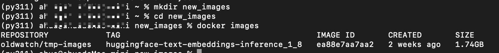
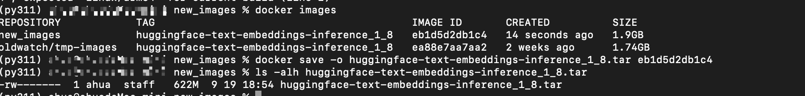
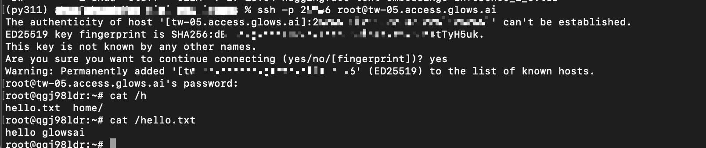
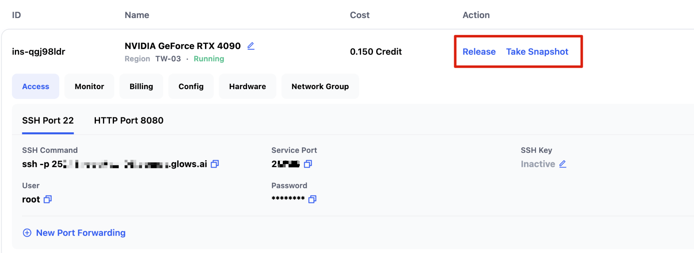

# Uploading Custom Docker Images on Glows.ai

This tutorial will guide you step by step on how to upload a local Docker image to Glows.ai, covering image preparation, packaging, uploading, and instance creation.

## Creating a Docker Image Tar Package

To ensure your image runs properly on Glows.ai, pay attention to the following:

- The image **ENTRYPOINT** must keep running (otherwise the container will exit automatically).
- Install and start the SSH service (for convenient instance access).

### Setup Instructions

It is recommended to create a separate `.sh` script as the ENTRYPOINT, for example `run_glowsai.sh`, containing startup commands for the container (SSH service or custom services). Example:

```bash
#!/bin/bash
# Start SSH service
echo "Starting SSH service..."
/usr/sbin/sshd -E /root/.ssh/sshd_running.log

# Custom Command
echo "hello glowsai" > /hello.txt

# Keep the container running
echo "Container running..."
tail -f /dev/null
```

Also, in your Dockerfile, include SSH installation and configuration, and set the ENTRYPOINT:

```bash
# Install and configure SSH server
RUN apt-get update && apt-get install -y openssh-server && \
    mkdir /var/run/sshd /root/.ssh && sed -ri 's/^#?PermitRootLogin\s+.*/PermitRootLogin yes/' /etc/ssh/sshd_config && \
    sed -ri 's/UsePAM yes/#UsePAM yes/g' /etc/ssh/sshd_config && \
    apt-get clean && \
    rm -rf /var/lib/apt/lists/* /tmp/* /var/tmp/*

# Copy and set permissions for the start script
COPY run_glowsai.sh /usr/bin/
RUN chmod +x /usr/bin/run_glowsai.sh
EXPOSE 22
# Set entrypoint
ENTRYPOINT ["/usr/bin/run_glowsai.sh"]
```

### Practical Steps

Before uploading your local image, ensure SSH is installed and running inside the image and that the ENTRYPOINT keeps running. Otherwise, follow these steps.



1. Create a directory `new_images` and inside it, create `run_glowsai.sh` with the following content:

```bash
#!/bin/bash
# Start SSH service
echo "Starting SSH service..."
/usr/sbin/sshd -E /root/.ssh/sshd_running.log

# Custom Command
echo "hello glowsai" > /hello.txt

# Keep the container running
echo "Container running..."
tail -f /dev/null
```

> Note: The `# Custom Command` section is where you can add any commands to run on container startup. Do not modify other parts to avoid startup failure.

2. Create a `Dockerfile` with the following content:

```bash
# Set the base image
FROM oldwatch/tmp-images:huggingface-text-embeddings-inference_1_8

# Install and configure SSH server
RUN apt-get update && apt-get install -y openssh-server && \
    mkdir /var/run/sshd /root/.ssh && sed -ri 's/^#?PermitRootLogin\s+.*/PermitRootLogin yes/' /etc/ssh/sshd_config && \
    sed -ri 's/UsePAM yes/#UsePAM yes/g' /etc/ssh/sshd_config && \
    apt-get clean && \
    rm -rf /var/lib/apt/lists/* /tmp/* /var/tmp/*

# Copy and set permissions for the start script
COPY run_glowsai.sh /usr/bin/
RUN chmod +x /usr/bin/run_glowsai.sh
EXPOSE 22
# Set entrypoint
ENTRYPOINT ["/usr/bin/run_glowsai.sh"]
```

3. Build the new image in the directory:

```bash
docker build -t new_images:huggingface-text-embeddings-inference_1_8 .
```


4. After a successful build, use `docker save` to package the image as a tar file:

```bash
docker save -o <output_file_path> <image_name_or_id>
```



## Uploading the Docker Image Tar Package

1. Open Glows.ai’s **Images** interface and click `Upload Image`.
2. Enter an image description and click **Select Image** to upload the tar package.


3. During upload, progress will be displayed. Once completed, the image can be used in Glows.ai.


## Creating an Instance

1. When creating an instance, select **My Images**. You will see the uploaded image. Choose it, and if a Datadrive Mount is needed, complete the instance creation process.


2. After the instance starts, manually set the ports you want to expose, e.g., SSH on port 22:

   - Click `New Port Forwarding`
   - Set **Service Port** to 22
   - **Do not check HTTPS**
   - Click `Create` to finish port forwarding


3. After about 10–20 seconds, port mapping will be established. The interface will show SSH connection info and password for local access.



4. If the instance runs other services that need public access, you can add additional port mappings. For HTTP services, check **HTTPS**.


5. For example, to run an HTTP service on port 8080, use the corresponding link from the instance interface to access it.


6. After modifying the environment or files, you can create a **Snapshot** or release the instance when no longer needed.



---

# Contact Us

If you have any questions or suggestions while using **Glows.ai**, feel free to reach out to us via email or Line.

**Glows.ai Email:** [support@glows.ai](mailto:support@glows.ai)

**Discord:** [https://discord.com/invite/glowsai](https://discord.com/invite/glowsai)

**Line:** [https://lin.ee/fHcoDgG](https://lin.ee/fHcoDgG)
