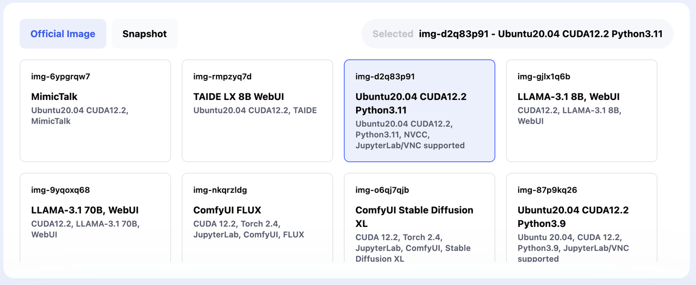
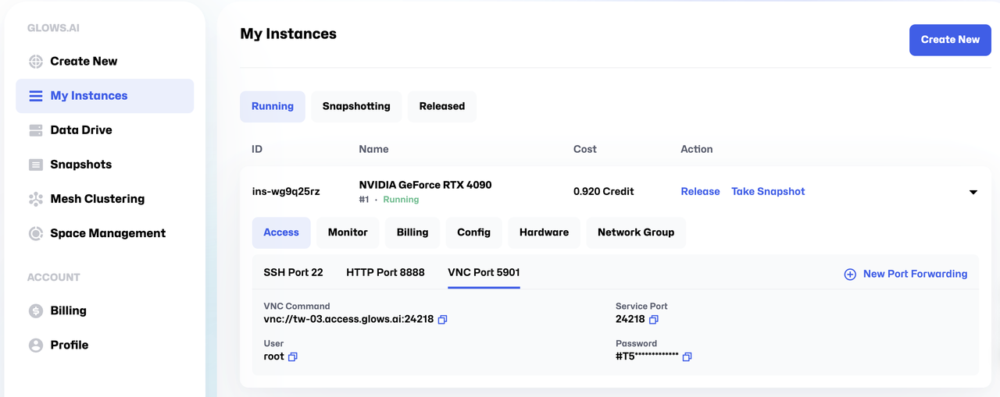
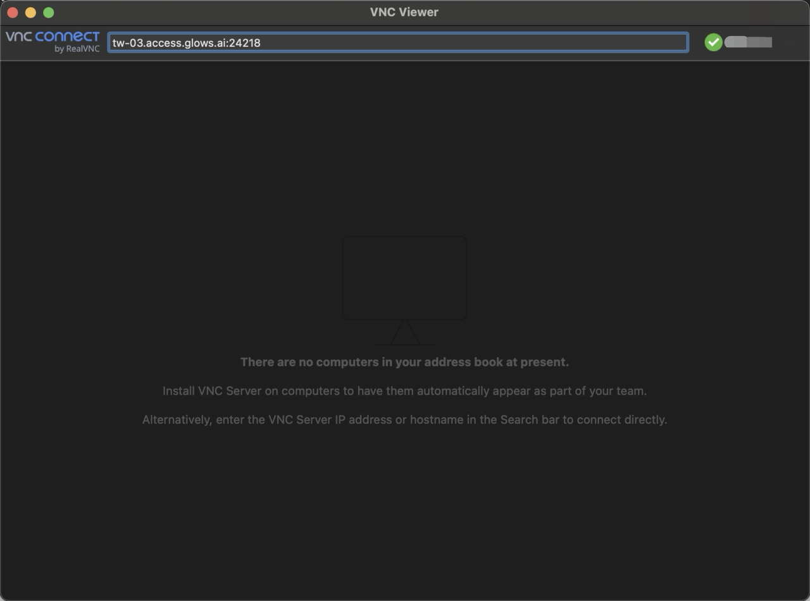
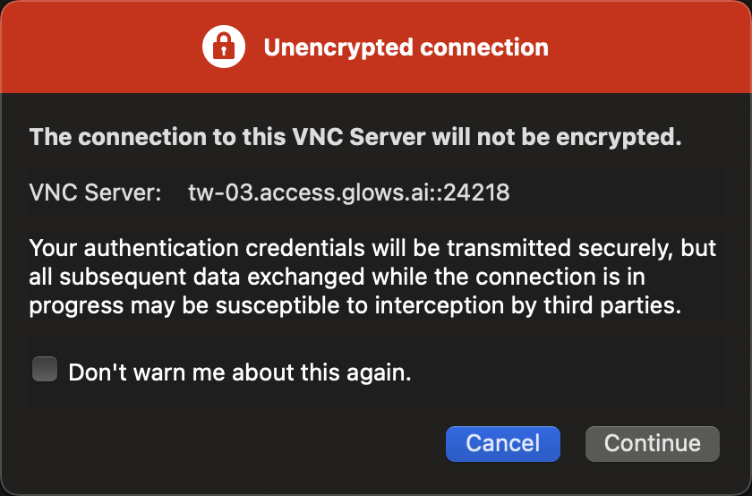
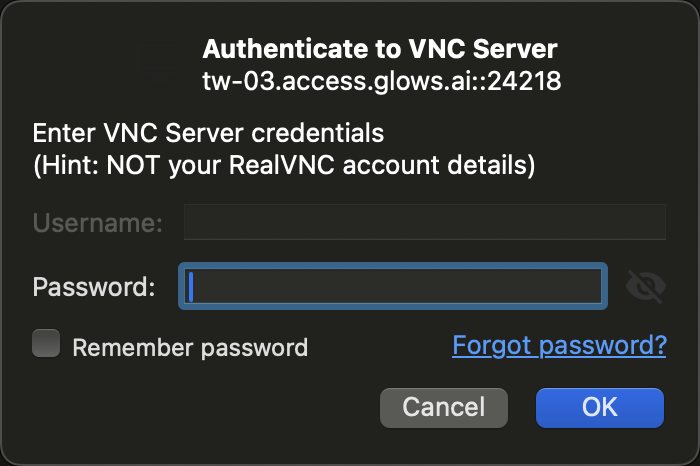
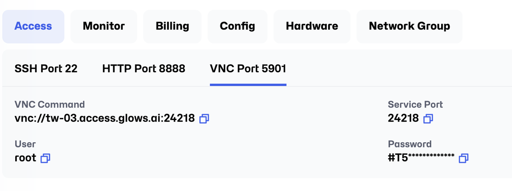
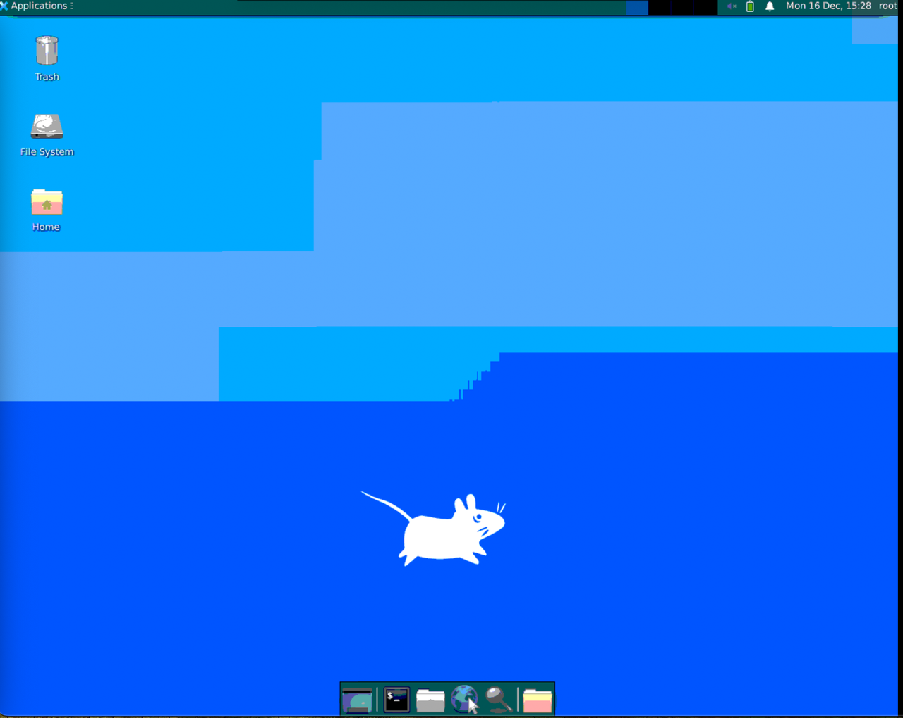

# How to Use VNC to Connect to Glows.ai’s Compute Resources

Currently, some instances and images on Glows.ai support the VNC protocol, allowing you to access the graphical interface of instances using VNC.
You can download the version you need from the official [VNC Viewer website](https://www.realvnc.com/en/).

## **Step1: Create an instance**
When setting up an instance, please select the desired image. You can verify if the image supports VNC before proceeding.

## **Step 2: Use VNC Viewer to connect to the machine**
Find VNC Command and other necessary information via My `Instances` - `Access` - `VNC Port`.

Open VNC Viewer and enter the VNC server address. Press Enter to connect automatically.

When the "Unencrypted connection" window appears, click `Continue` to proceed.

A window will appear, prompting you to enter the password. 

You can find the password on the page as well. 

Alternatively, you can click the `Copy Password` icon to copy it directly. 

Once you have entered the password successfully, you will gain access to the server VNC interface, as shown below. 

