# How to Download and Upload Cloud Drive Data on Glows.ai

This guide will walk you through how to download from and upload to cloud storage services such as Google Drive on a Glows.ai machine. Please ensure the image you selected **includes SSH or JupyterLab features**.

---

## **Step 1: Create an Instance**

First, create a new instance on Glows.ai according to your needs. If you're not sure how, refer to the [Create a New Instance Guide](https://docs.glows.ai/docs/Create%20New).

---

## **Step 2: Install Rclone**

> **Rclone** is a powerful command-line tool for synchronizing files with various cloud storage services. It supports encryption, compression, and multi-threaded transfers, making cloud and local data management more efficient.

Once your instance status is `Running`, go to the `Access` section and click the `Open` button next to port `8888` to launch the JupyterLab interface.

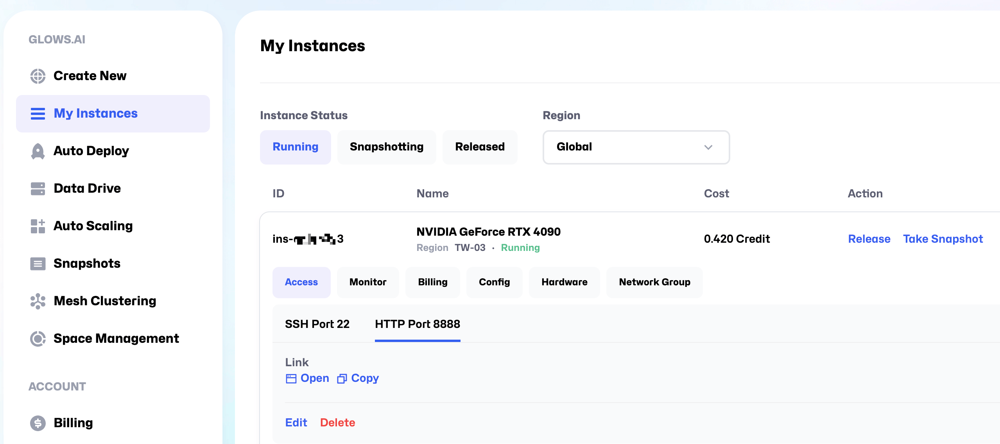

Inside **JupyterLab**, click the Terminal icon in the Launcher to open a terminal.

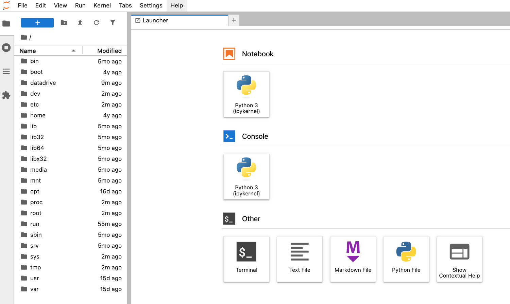

Enter the following command in the terminal to install Rclone:

```bash
curl https://rclone.org/install.sh | bash
```

After installation, use the following command to verify that Rclone was installed correctly:

```bash
rclone --version
```

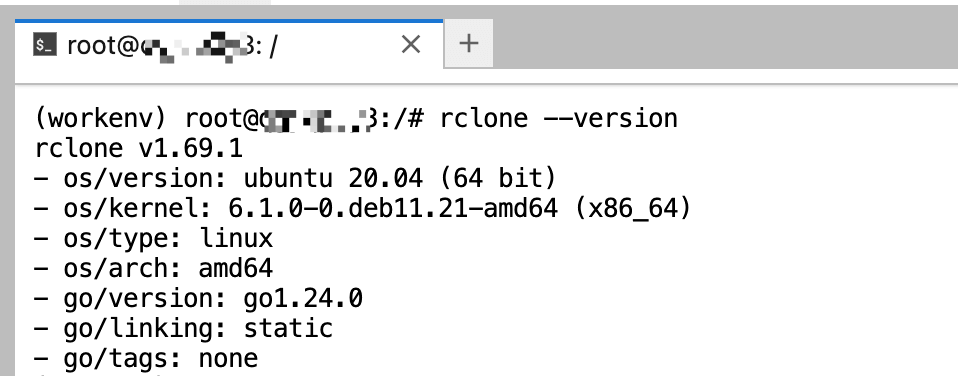

---

## **Step 3: Configure Google Drive**

Start the configuration process by entering:

```bash
rclone config
```

Follow the on-screen instructions:

1. Type `n` to create a new remote (remote is a storage configuration in Rclone that represents your cloud drive; you can name it however you like for easy reference later).

2. Then, name your remote (e.g., `glows` or `mydrive`), so you can refer to it easily in commands.

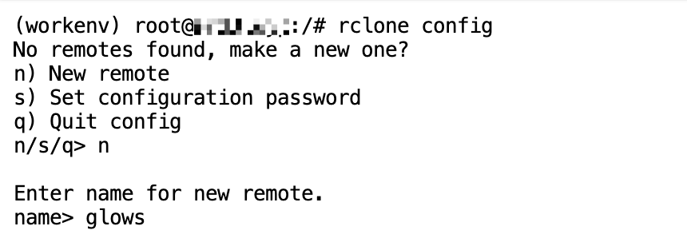

Next, choose the cloud storage service you want to connect to. In this guide, we'll use Google Drive. Enter `drive` or the corresponding number (e.g., `20`).

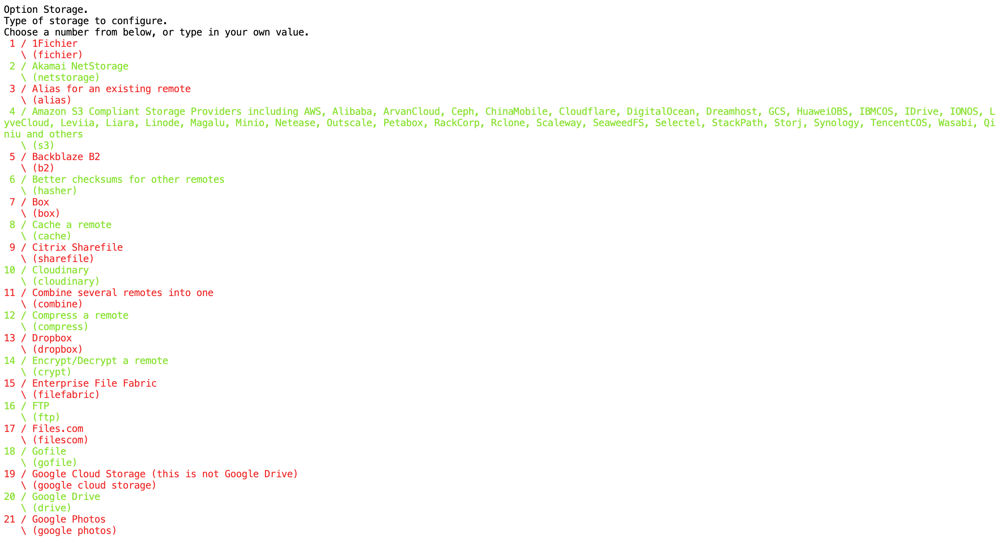
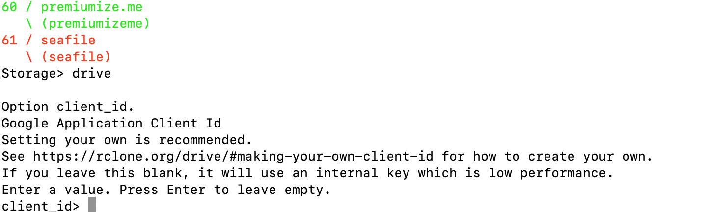

- For `client_id` and `client_secret`, simply press `Enter` to use the default values.
- For permissions, enter `1` to grant full access.

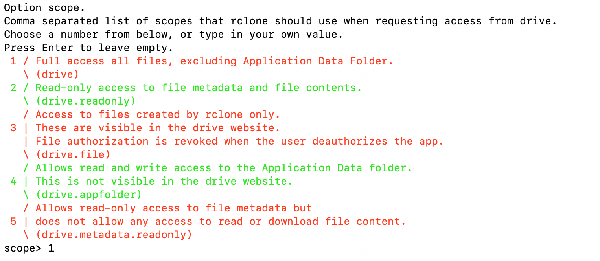

You can press `Enter` to accept the default values for the remaining options.

---

### Note: Choosing an Authentication Method

At this stage, you’ll be prompted to authenticate with Google Drive using one of two methods:

- **Method 1:** Authenticate directly using your browser (only works for local machines).
- **Method 2:** Use Rclone installed on your local computer with SSH port forwarding ✅ **Recommended**

Since authentication must occur from the Glows.ai server, simply clicking the link in your local browser won't work. We recommend using method 2:

Open your **local terminal (CMD/Terminal)** and run the following command to initiate SSH port forwarding:

```bash
ssh -p 23482 -NL 53682:localhost:53682 root@tw-02.access.glows.ai
```

**Format explanation:**  
`ssh -p [SSH port] -NL 53682:localhost:53682 root@[SSH host]`


After entering the SSH password and pressing `Enter`, if no errors appear, the port forwarding is successful. Then, open the Google authentication link provided in the Rclone terminal **in your local browser**, sign in with your Google account, and authorize access.

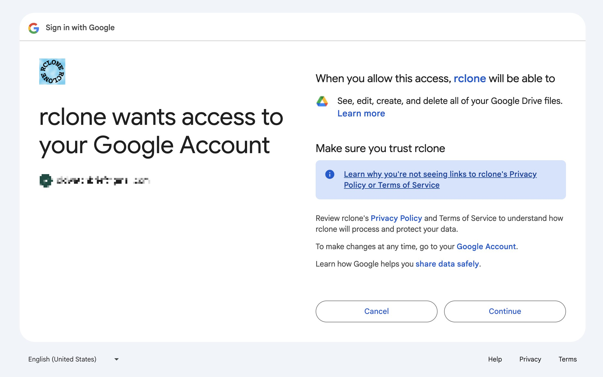

When the page shows `Success!`, authentication is complete.

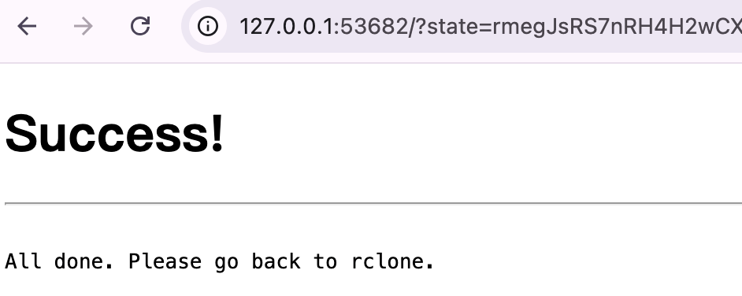

Back in the server's Rclone setup, when asked about setting up Team Drive, press `Enter` to skip. You should then see the `Configuration complete` message along with the setup details.


---

## **Step 4: Uploading and Downloading Files**

### Downloading from Google Drive to Your Instance

```bash
# Format:
rclone copy [Remote Name]:[Google Drive file path] [Local path] --progress

# Example:
rclone copy glows:/data/glows.zip ./ --progress
```

This command downloads the file `/data/glows.zip` from Google Drive to your current local directory. The `--progress` flag shows the download progress.

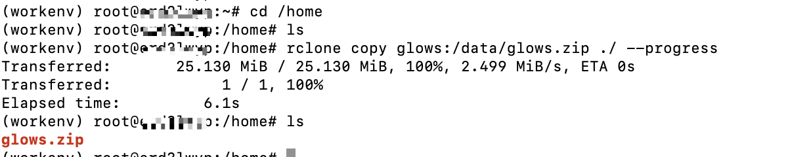

---

### Uploading from Your Instance to Google Drive

```bash
# Format:
rclone copy [Local file path] [Remote Name]:[Google Drive destination path] --progress

# Example:
rclone copy 123.txt glows:/data --progress
```

This command uploads the local file `123.txt` to the `/data` folder in Google Drive.

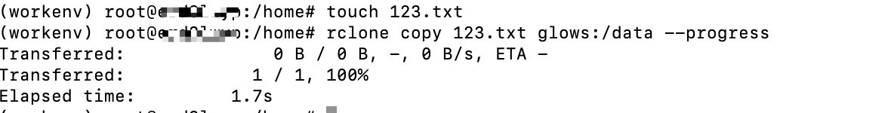
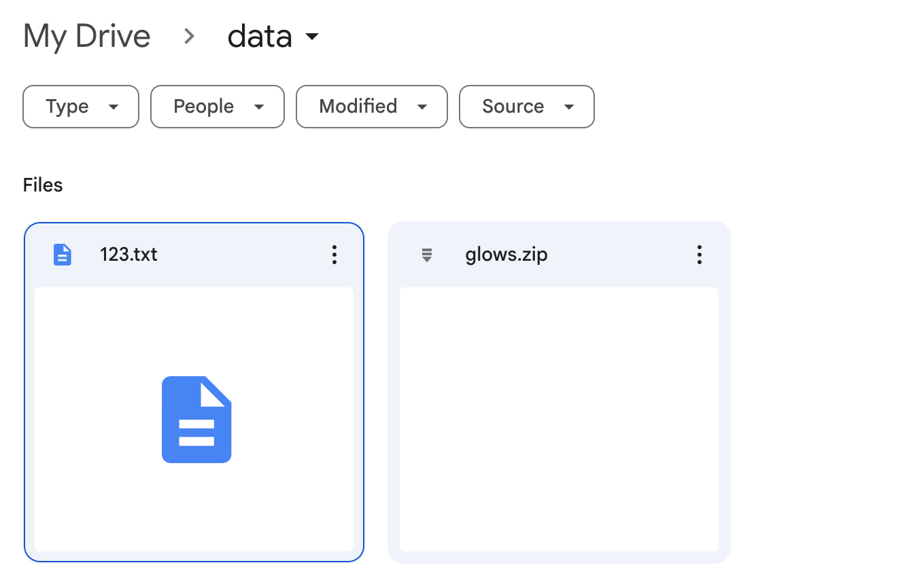

---

## Contact Us

If you have any questions or feedback while using Glows.ai, feel free to contact us:

**Email: support@glows.ai**
