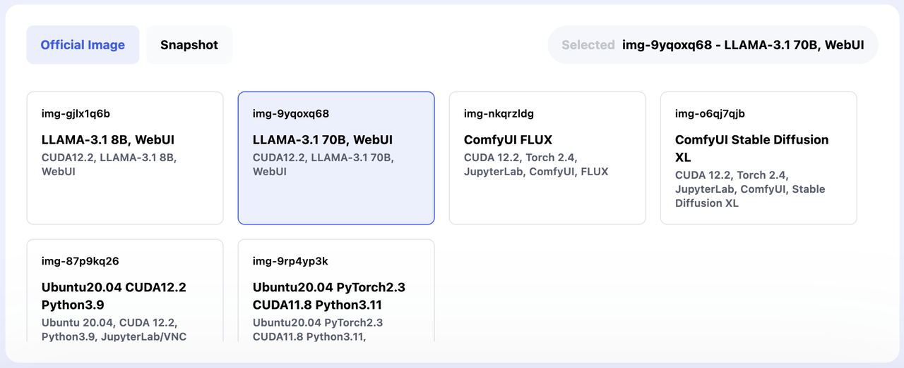
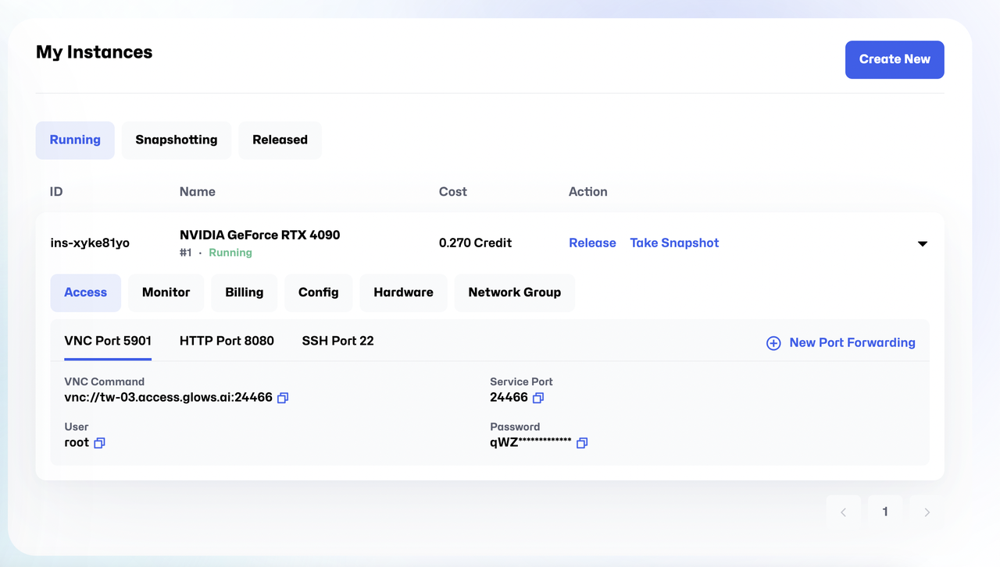

# Quick Start Guide: Running LLAMA3.1 on Glows.ai

LLaMA, developed by Meta, a global leader in AI research, is a flagship model in natural language processing (NLP). Powered by a scalable architecture with model sizes ranging from 7 billion to 65 billion parameters, LLaMA excels in tasks like multilingual text generation, conversational AI, and advanced language reasoning, unlocking limitless possibilities for enterprises, researchers, and developers.

Now, with community-driven efforts and platform integrations, a fully prepared environment for running LLaMA is readily available. This includes pre-trained model files, computational resources, and user-friendly tools. In just a few steps, you can set up your environment, access WebUIs, and harness the full power of this state-of-the-art generative AI model.

# Step-by-Step Instructions

## Step 1: Log in to Glows.ai and launch the environment

1. **Sign up and log in**
   Visit [Glows.ai](https://glows.ai/) and complete the sign-up process to log into your account.

2. **Launch the environment**
   In the dashboard, locate the **LLAMA** task template. With a single click, the system will automatically configure all necessary resources and dependencies.
   **Note:** Glows.ai provides two configurations of Llama 3.1:

- **8B**: Optimized for efficient deployment and development on consumer-grade GPUs.
- **70B**: Designed for large-scale AI-native applications. Utilizing the 70B configuration requires at least **2 Unit Qty NVIDIA GeForce RTX 4090 GPUs**.



## Step 2: Access the Llama 3.1

You can access the Llama 3.1 environment through the following methods:


1. **VNC (Port 5901)**

- Find the VNC Command and other necessary information via `My Instances` > `Access` > `VNC Port`.
- For detailed instructions, refer to the guide: [How to Use VNC to Connect to Glows.ai’s Compute Resources](https://docs.glows.ai/tutorials/vnc).

2. **HTTP WebUI (Port 8080)**

- Open the URL: `https://tw-03.access.glows.ai:24527?token=iOuz4vDMME`
- The interface is user-friendly and allows you to input text and adjust voice parameters easily.

3. **SSH access (Port 22)**

- SSH provides command-line access to the backend environment for advanced operations.

- **SSH command**:

```bash
   ssh user@<your-instance> -p 22
```

- **Password**: Refer to the instance details in your Glows.ai dashboard.

## Step 3: Saving and Integrating Your Results

1. **Export the output**

- The WebUI allows you to save the generated content directly to your local device for future use.

2. **Further integration**

- For large-scale text processing or seamless integration into your business workflows, use Glows.ai's API deployment tools to incorporate Llama 3.1 into your applications or services.
