# How to run DeepSeek-R1 on multiple machines with multiple GPUs using SGLang on Glows.ai

This tutorial walks you through renting GPUs from Glows.ai and running the DeepSeek-R1 model with SGLang in a multi-node, multi-GPU environment.

## Step 1: Set up Storage Space

After registering and logging in to [Glows.ai](https://glows.ai/), enter [Space Management](https://platform.glows.ai/space) to allocate `Datadrive` (for storage space) and `Snapshot` (for saving snapshot). If you have already made a purchase, you can skip this step.

Follow the instructions shown in the images:

1. click `Upgrade` on the interface and purchase a 5GB space. You can purchase larger storage as needed for your actual use.

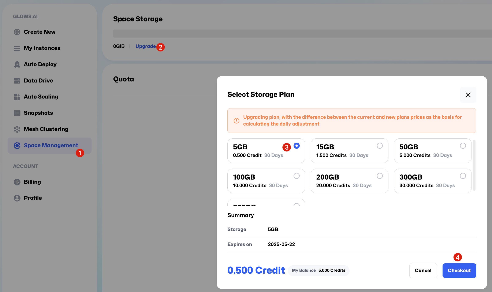

2. After purchasing the storage plan, follow the sequence shown in the image and click `Modify`. In this tutorial, we allocate 3GB to `Snapshot` and 2GB to the `Datadrive` "TW-01", then click `Update`. The space allocation shown here is an example.. you can adjust the sizes according to your project needs during actual use.

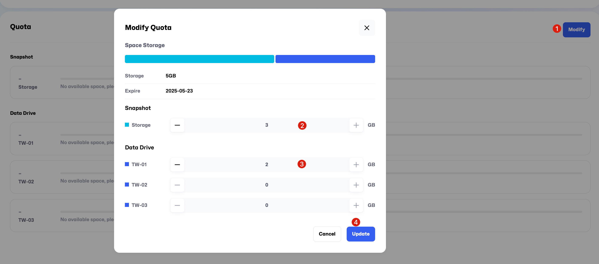

## Step 2: Create an instance

On the [Create New](https://platform.glows.ai/create) page, select ` Inference GPU` -- `NVIDIA GeForce RTX 4090`, and choose the environment `SGLang 0.4.2`. You can also select other machines or environments based on your specific requirements.

For this demo, we’ll be using two `RTX 4090` GPUs. Each RTX 4090 has 24GB of VRAM, which is sufficient to run the DeepSeek-R1-Distill-Qwen-14B model. If you want to run the DeepSeek-R1 671B model, based on our tests, you will need either two 8-card H100 machines or a single 8-card H200 machine. If you encounter any issues during the setup process, feel free to contact us at any time.

| Model Name                   | Recommended GPU Specs | Minimum Number of Nodes | Notes                                        |
| ---------------------------- | --------------------- | ----------------------- | -------------------------------------------- |
| DeepSeek-R1-Distill-Qwen-14B | 1x RTX 4090           | 2                       | Each GPU requires 24GB of VRAM               |
| DeepSeek-R1 671B             | 8x H100               | 2                       | Recommended: 2 machines, each with 8 GPUs    |
| DeepSeek-R1 671B             | 8x H200               | 1                       | Multiple high-end GPUs must run on same node |

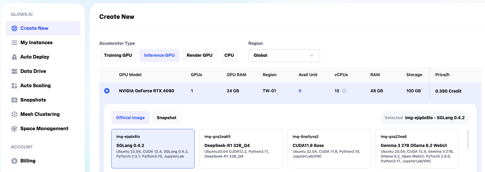

At the bottom of the page, click `Mount` to mount your own `Datadrive` to the instance. This step allows you to share files across multiple instances and also simplifies the process of permanently storing files from the machine or downloading them to your local device later.

Once completed, click `Complete Checkout` to finalize the setup.

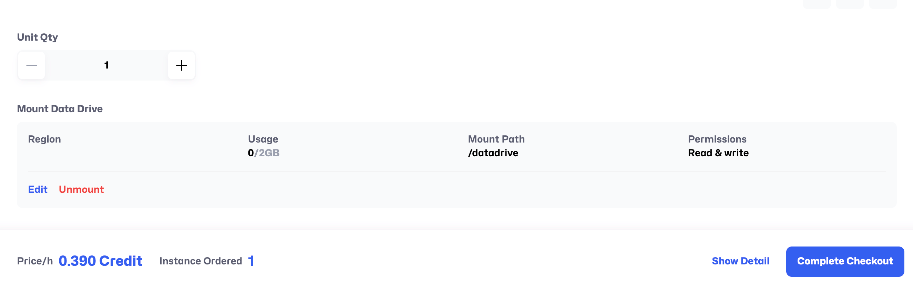

To run a large model inference service using SGLang across multiple machines and GPUs, you will need to repeat the steps above to create another instance. Once both instances are successfully created, you will see two instance records on the **My Instances** page.

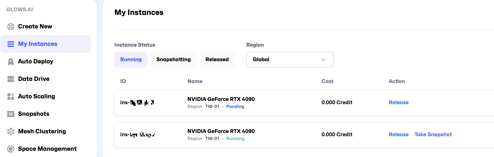

It takes about 30–50 seconds for an instance to start. Once its status changes to `Running`, it will be ready for use.

## Step 3: Launch the program

### 1. Download the model

After the instance starts successfully, you will see links for SSH access (SSH Port 22), JupyterLab access (HTTP Port 8888), and HTTP Port 8000. Use your preferred remote connection method to access the instance (we recommend JupyterLab for its convenience).

**Note:** If you need to map additional ports during use, you can click the `New Port Forwarding` button to add them.
If the port you are adding uses the HTTP protocol, remember to check the HTTP option when adding the new port.


Click `Open` to access the JupyterLab link on HTTP Port 8888.
Create a new Terminal, then enter the following command to download the model into the /home/DeepSeek-R1-Distill-Qwen-14B directory on the instance. The model is approximately 28GB in total, with an estimated download time of 5–10 minutes.

**Note:** You need to open JupyterLab on both nodes and run the following command on each to download the model.

```bash
huggingface-cli download deepseek-ai/DeepSeek-R1-Distill-Qwen-14B --local-dir /home/DeepSeek-R1-Distill-Qwen-14B
```

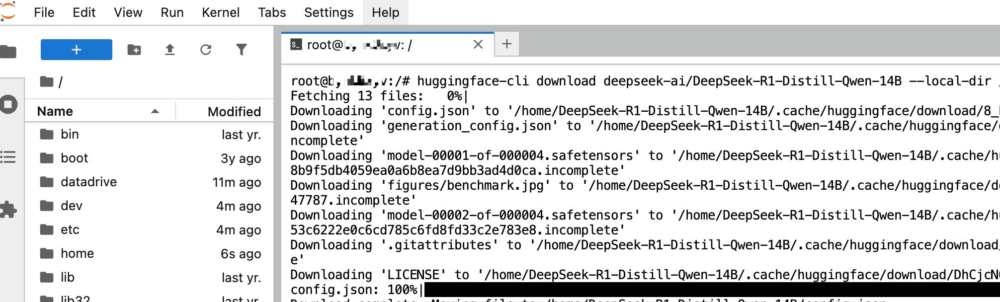

### 2. Create a cluster

While the model is downloading, you can begin setting up internal networking between the two instances using Glows.ai **Mesh Clustering** feature.

Go to **Mesh Clustering** page and follow the steps shown in the guide to create a new Network Group.

**Important settings:**

- Mesh Type：Network Group
- Region：TW-01
- Name：You can choose any name you like, for example, SGLang.

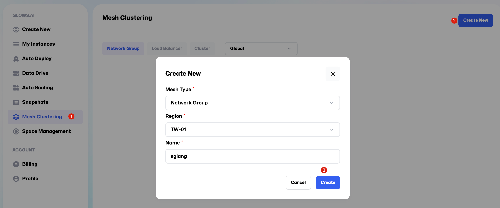

Click `Add Instance` to add the two instances you created earlier to the Network Group.

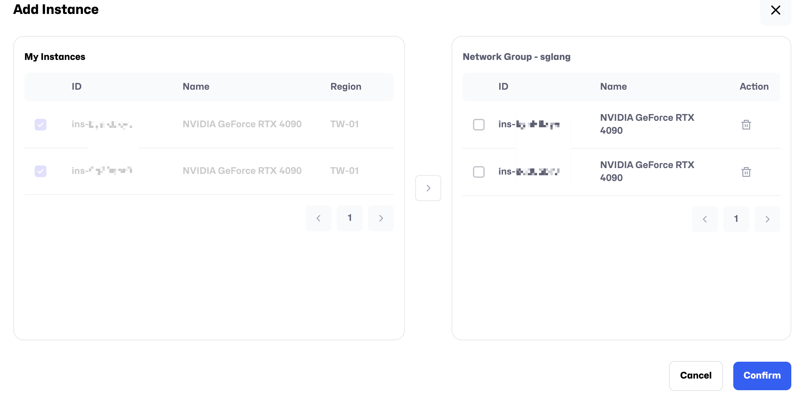

After adding the instances, the Status will change to `Connected`, indicating that the internal network connection is successful. The IP CIDR shown earlier represents the internal IP addresses. For example, in the image below, the internal IPs of the two machines are 192.168.1.1 and 192.168.1.2, respectively.

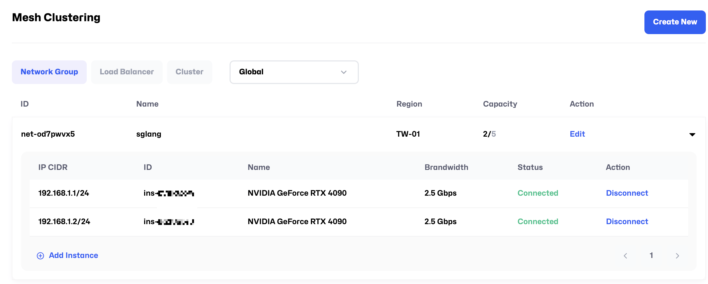

### 3. Launch the service

After the model download is complete, run the command `ip -4 a`to check the internal network interface name and internal IP address, as shown in the following image:

- Internal IP: 192.168.1.1
- Internal network interface: meth340

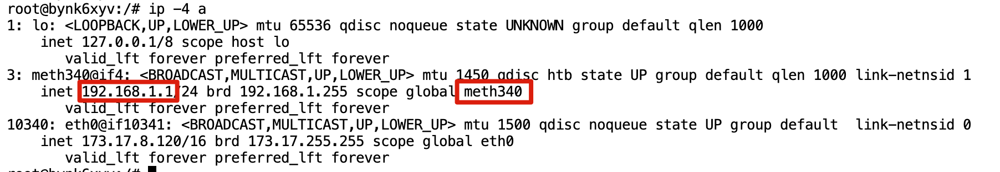

Run the following commands on both nodes, one after the other:

```bash
# On Instance 1, run the following commands in order
# Note: Replace the values of GLOO_SOCKET_IFNAME and NCCL_SOCKET_IFNAME with the network interface name you found using the ip -4 a command.
# Note: Replace the values of SGLANG_HOST_IP and HOST_IP with the internal IP address of your designated master node.
export GLOO_SOCKET_IFNAME=meth340
export NCCL_SOCKET_IFNAME=meth340
export SGLANG_HOST_IP=192.168.1.1
export HOST_IP=192.168.1.1
python3 -m sglang.launch_server --model /home/DeepSeek-R1-Distill-Qwen-14B --port 8000 --tp 2 --dist-init-addr 192.168.1.1:6379 --nnodes 2 --node-rank 0 --trust-remote-code --host 0.0.0.0
```


```bash
# On Instance 2, run the following commands in order
# Note: Replace the values of GLOO_SOCKET_IFNAME and NCCL_SOCKET_IFNAME with the network interface name you found using the ip -4 a command.
# Note: Replace the values of SGLANG_HOST_IP and HOST_IP with the internal IP address of your designated master node.
export GLOO_SOCKET_IFNAME=meth341
export NCCL_SOCKET_IFNAME=meth341
export SGLANG_HOST_IP=192.168.1.1
export HOST_IP=192.168.1.1
python3 -m sglang.launch_server --model /home/DeepSeek-R1-Distill-Qwen-14B --port 8000 --tp 2 --dist-init-addr 192.168.1.1:6379 --nnodes 2 --node-rank 1 --trust-remote-code --host 0.0.0.0
```

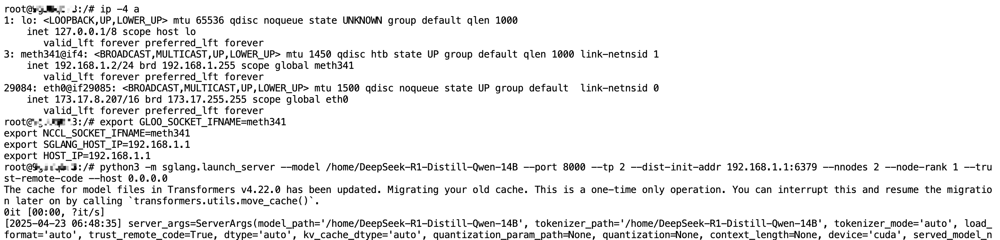

The screenshot of normal operation is shown below. Model loading typically completes within 1 minute.


## Step 4: API Testing

On **My Instances** page, copy the HTTP Port 8000 link of the master node.
You can ignore the token part in the link. For example:

```bash
Copied link：https://tw-03.access.glows.ai:24516?token=hSFGABSM
Actual link：https://tw-03.access.glows.ai:24516
```

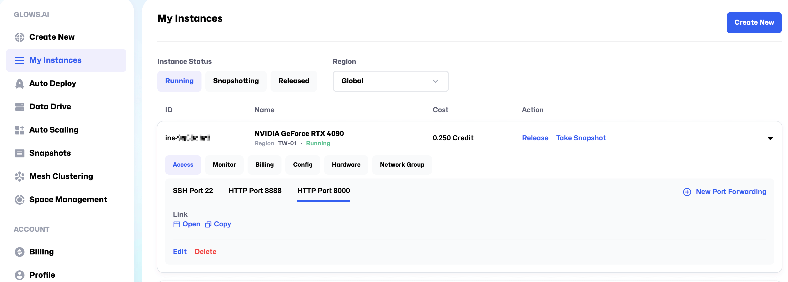

The following is test code. Simply replace the base_url in the code with the link you copied.

```python
import openai
client = openai.Client(
    base_url="https://tw-03.access.glows.ai:24516/v1", api_key="EMPTY")

# Chat completion
response = client.chat.completions.create(
    model="default",
    messages=[
        {"role": "system", "content": "You are a helpful AI assistant"},
        {"role": "user", "content": "What model are you and who developed it?"},
    ],
    temperature=0.6
)
print(response)
```

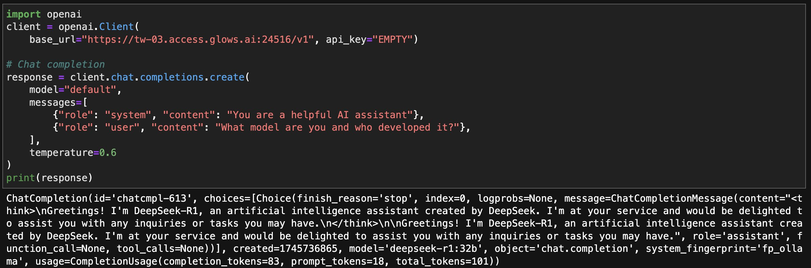

## Step 5: Data storage and snapshots

To use data storage and snapshot features, you first need to purchase storage space on the [Space Management](https://platform.glows.ai/space) page.

### 1. Data storage

During usage, if your program generates large output files saved on the instance's hard drive, and you want to download them to your local device without keeping the instance running. You can move or copy the files to the `/datadrive` directory using `cp/mv` commands (or you can set the output path to `/datadrive` from the beginning in your program).
In this way, even after releasing the instance, you can still download the files from the [**Data Drive**](https://platform.glows.ai/data) page. Furthermore, multiple instances can share the data stored in `/datadrive`.

For example, in this case where we are running a large model, normally we would need to download the model separately on each instance. However, if we download the model directly into `/datadrive` (or upload it there from local storage), there’s no need to download it again on each instance, and every created instance can access it immediately.

### 2. Snapshot

If you make any changes to the system environment during use — for example, installing new Python packages via pip — you can create a Snapshot afterward. Once you confirm that the environment is properly configured, go to the **My Instances** page and click the `Take Snapshot` button to create one. You can then create a new instance directly from the snapshot without needing to reinstall or reconfigure the environment.

If you haven't made any changes to the environment, you don’t need to create a snapshot.

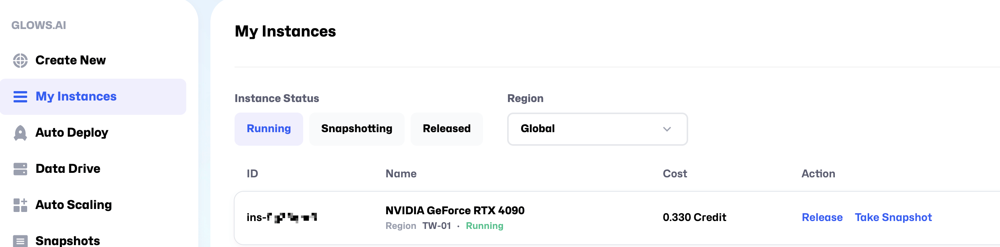

## Step 6: Shut down instances

After you have finished using the instance and saved the necessary environment or data, go to the My Instances page and click the Release button to shut it down.
Once the instance is released, billing will stop.
If you forget to release the instance, it will continue to incur charges. If your credits reach zero, the system will automatically create a snapshot and then release the machine.

## Contact Us

If you have any questions or feedback while using Glows.ai, feel free to contact us:

**Email: support@glows.ai**
