# How to Create Realistic Voice and Generate Speech with BreezyVoice on Glows.ai

This tutorial will guide you step-by-step to run the voice synthesis system **BreezyVoice** on Glows.ai, leveraging the **NVIDIA GeForce RTX 4090** GPU to quickly generate personalized voice audio files.

**[BreezyVoice](https://github.com/mtkresearch/BreezyVoice)** is an open-source system focused on Chinese Text-to-Speech (TTS) synthesis, featuring:

- Voice cloning with only **5 seconds** of voice sample
- Natural and fluent speech output, close to a real human voice
- Based on the [CosyVoice](https://github.com/FunAudioLLM/CosyVoice) extension, part of the Breeze2 series

Next, we will use Glows.ai’s cloud GPU resources to run **BreezyVoice**, create your voice, and generate speech files.

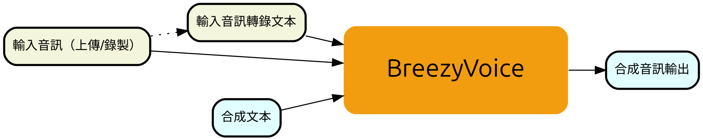

## Step 1: Create a New Instance

Create an instance on Glows.ai by following this [tutorial](https://docs.glows.ai/docs/Create%20New). Make sure to select the official **BreezyVoice WebUI** image.

On the `Create New` page, select **Inference GPU -- 4090**, then choose the **BreezyVoice WebUI** image. This image contains all required environments and will launch the BreezyVoice WebUI service on port 8080.

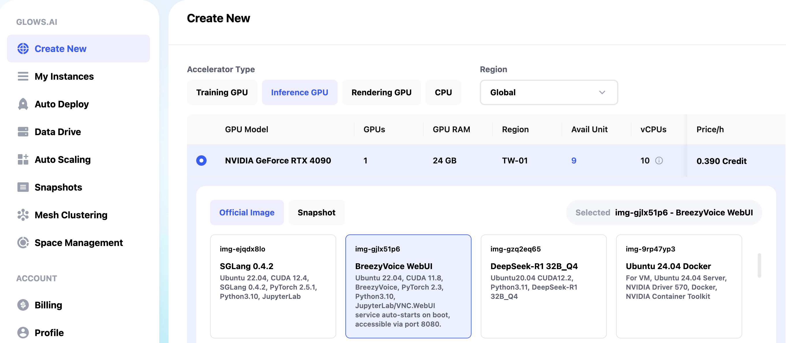

**Data Drive** is Glows.ai’s cloud storage service. Users can upload data, models, or code to Data Drive first. When creating an instance, clicking the **Mount** button links the Data Drive to the instance, making it easy to access files inside the instance.

Once everything is ready, click the `Complete Checkout` button at the bottom right to create the instance.

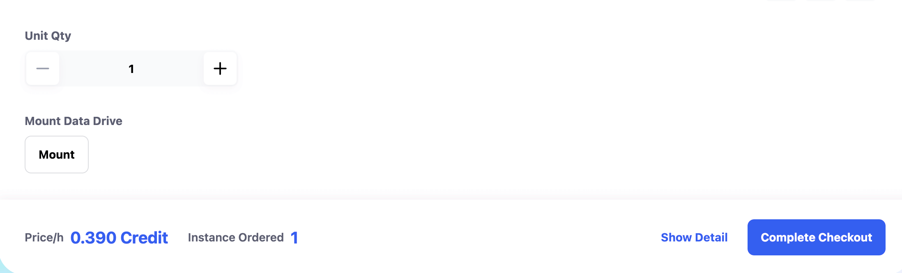

It takes about 30–60 seconds to start the **BreezyVoice WebUI** instance. Once the instance is up, you can see its status and info on the `My Instances` page. Relevant ports include:

- **SSH Port 22** : SSH connection
- **HTTP Port 8888** : for JupyterLab
- **HTTP Port 8080** : for BreezyVoice WebUI service

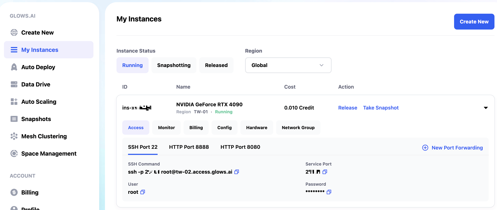

## Step 2: Use BreezyVoice WebUI

On the `My Instances` page, click the `Open` button under **HTTP Port 8080** to launch the **BreezyVoice WebUI** service.

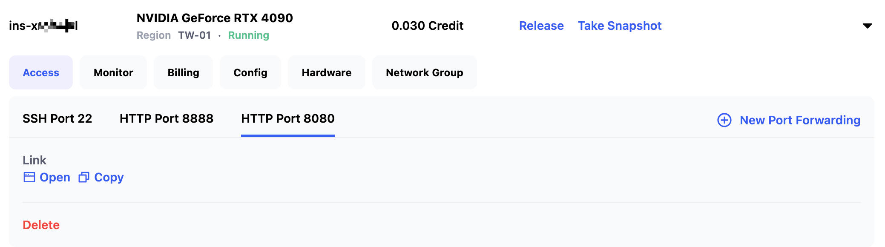

In the **BreezyVoice WebUI**, you can upload a recorded audio file or click `Record` to record a voice sample (recommended 20–30 seconds).

Next, enter the corresponding transcript in the text box.

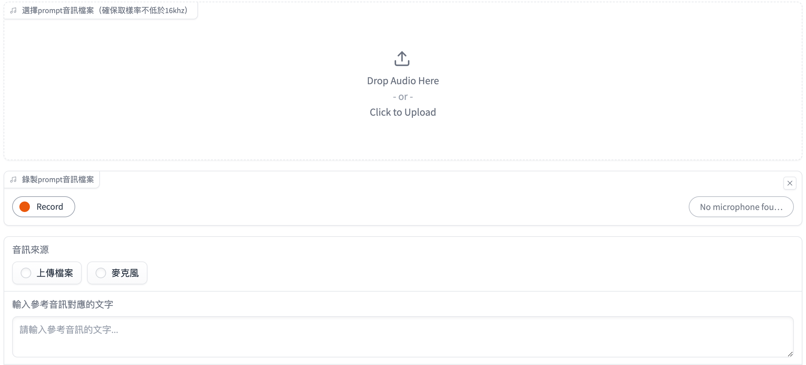

Then, input the text you want the AI to synthesize in the "Enter text to synthesize" box, and click `Synthesize Audio`. The generation takes about 7 seconds (depending on the size of the voice file and the length of the synthesized speech).

After synthesis completes, click the `Play` button to listen, or click the `Download` button at the top right to save the audio file to **Data Drive**.

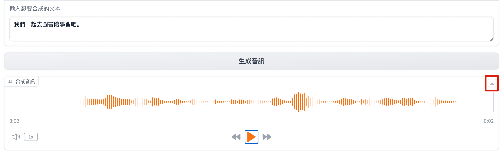

## Step 3: Call BreezyVoice API

Besides using it via browser, **BreezyVoice** can also be used as an API service.

In `My Instances`, click `Open` on **HTTP Port 8888** to launch JupyterLab. Then open the `Terminal` under the `Other` category to get a command-line interface.

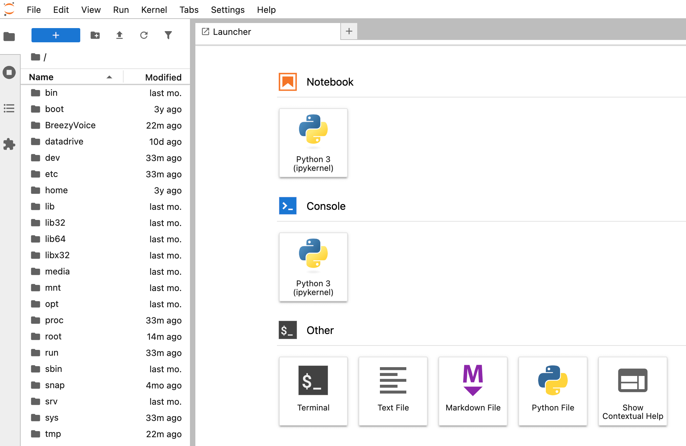

Open the file `BreezyVoice-api.py` in the left sidebar, change the port from 8080 to 8081, and save the file with `Ctrl + S` to avoid conflict with the BreezyVoice WebUI service port.

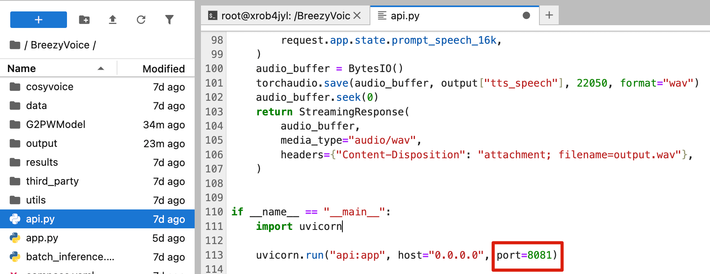

If you want to use custom voice samples, open `api.py` and modify the audio file paths and corresponding transcript text in the code to your own audio and text.

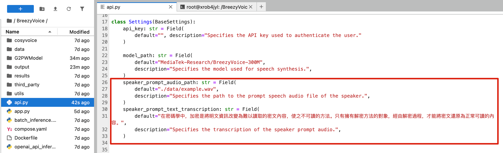

In the terminal, run the following commands sequentially to start the API service:

```bash
cd /BreezyVoice/
python api.py
```

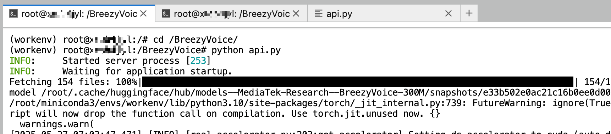

The service listens on port 8081. In the **My Instances** page, click `New Port Forwarding` to add a port forwarding rule. Fill in the following information and click `Create`:

- Port number: 8081
- Protocol type: HTTPS

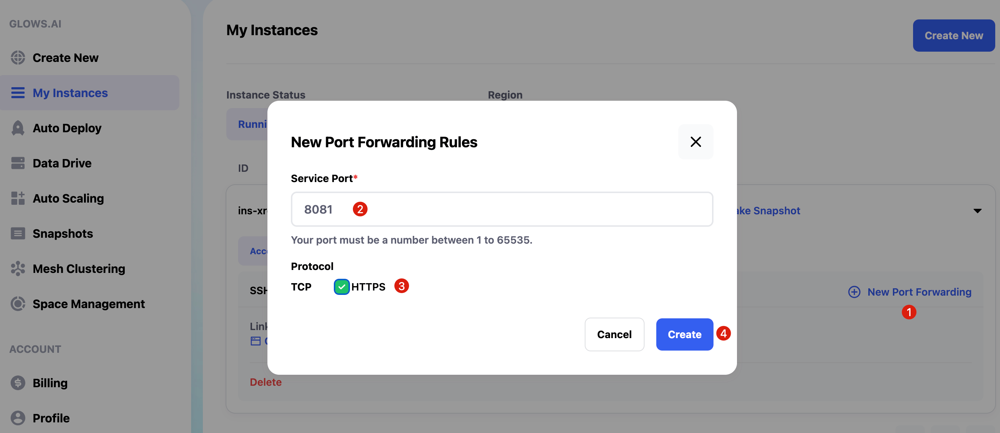

It takes about 15 seconds to complete the port setup. If the page does not refresh automatically, please refresh manually. Then you can click the `Copy` button next to HTTP Port 8081 to copy the API link.

```bash
https://tw-02.access.glows.ai:23197?token=jrF2uJF3yj
# The token part is a parameter tag and can be omitted
```

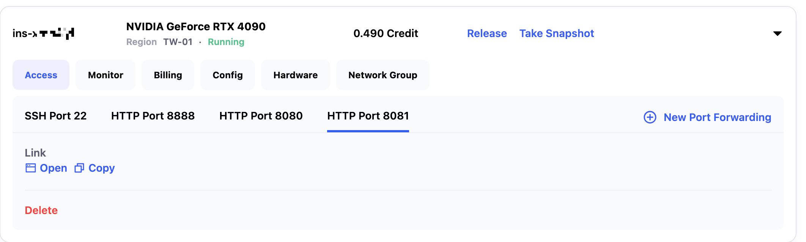

After installing the OpenAI package locally, you can test the API with the following code:

```python
# If OpenAI is not installed, install it first via: pip install openai
import openai

client = openai.Client(base_url="https://tw-02.access.glows.ai:23197", api_key="sk-template")

response = client.audio.speech.create(
    model="tts-1",
    voice="alloy",
    input="放學我們一起去打籃球怎麼樣，今天天氣不錯",
)

speech_file_path = "./test_speech.wav"
with open(speech_file_path, "wb") as audio_file:
    audio_file.write(response.content)
```

Alternatively, use the following curl command to call the API directly:

```bash
curl -X POST "https://tw-02.access.glows.ai:23197/v1/audio/speech" \
  -H "Authorization: Bearer sk-template" \
  -H "Content-Type: application/json" \
  --data '{
    "model": "tts-1",
    "voice": "alloy",
    "input": "放學我們一起去打籃球怎麼樣，今天天氣不錯"
  }' --output test_speech.wav
```

After execution, a file named `test_speech.wav` will be generated locally, which is the synthesized speech audio.

## Advanced Usage: **Auto Deploy**

The previous method requires manual creation and release of instances, which can be cumbersome if usage is infrequent.

Therefore, Glows.ai offers an **Auto Deploy** service. After configuration, you get a fixed link. When this link receives a request, Glows.ai automatically creates an instance and processes the request. If no new requests are received within 5 minutes, the instance will be automatically released.

Follow the steps below for actual operation.

### Configure **Auto Deploy**

Go to the `Auto Deploy` page and click the `New Deploy` button at the top right to add a deployment configuration.


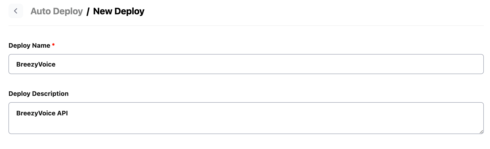

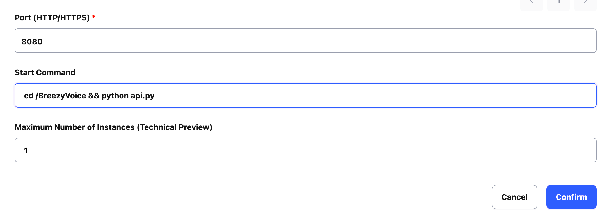

### View Configuration Info


### Call Auto Deploy Link

Calling the API is the same as before, just replace the API link with the **Auto Deploy** link.

```bash
curl -X POST "https://tw-01.sgw.glows.ai:xxxxxx/v1/audio/speech" \
  -H "Authorization: Bearer sk-template" \
  -H "Content-Type: application/json" \
  --data '{
    "model": "tts-1",
    "voice": "alloy",
    "input": "放學我們一起去打籃球怎麼樣，今天天氣不錯"
  }' --output test_speech.wav
```

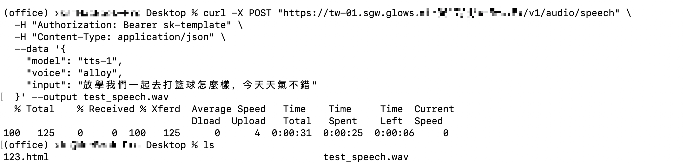

After the request finishes, if no new API calls are made within 5 minutes, the system will automatically release the instance resources.

On the Auto Deploy page, you can see the total cost and instance status for each deployment. The statuses mean:

- **Standby**: Configuration is ready, no running instance currently.
- **Idle**: Request received, instance is being created; or instance is being released automatically.
- **Running**: Instance successfully created and processing requests. After completion, it waits for new requests; if none for 5 minutes, the instance is released automatically.

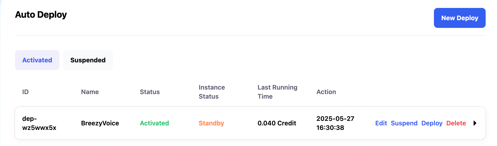

## Contact Us

If you have any questions or feedback while using Glows.ai, feel free to contact us:

- **Email:** [support@glows.ai](mailto:support@glows.ai)
- **Line link:** [https://lin.ee/fHcoDgG](https://github.com/mtkresearch/BreezyVoice)
