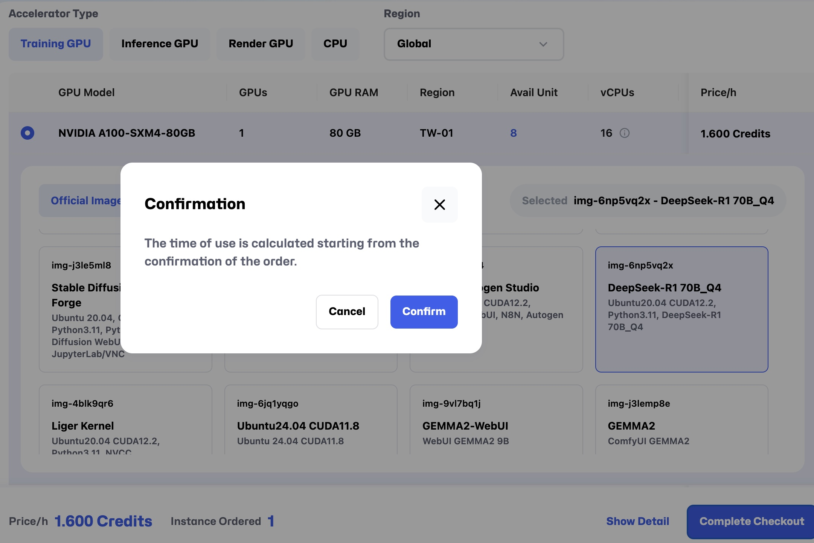

# 新しいインスタンスの作成

本章では、Glows.AI 上で新しいインスタンスを作成する方法をご案内します。
 計算ニーズに応じて、**GPU** または **CPU** の種類を選択できます。以下に具体的な操作手順を示します。

---

## **ステップ 1: インスタンスの種類を選択**

**Create New** ページにアクセスした後、まずインスタンスの種類を選択します。

- **GPU**: AI トレーニング、大規模データ処理、またはグラフィック集約型タスクが必要な場合はこちらを選択してください。
- **CPU**: まず CPU でプログラムをデバッグし、その後 GPU に切り替えてトレーニングしたい場合、または GPU 加速を必要としない高い処理能力が必要なタスクの場合はこちらを選択してください。

---

## **ステップ 2: GPU または CPU モデルの選択**

**GPU モデル**:

- **GPU** を選択すると、以下の詳細スペックが表示されます:

  - **GPUs**: 1 ユニットあたりの GPU 数量。
  - **GPU RAM**: GPU の総メモリ容量。
  - **CPU Model**: GPU とペアリングされる CPU モデル。
  - **Avail Unit**: その GPU モデルで利用可能なユニット数。
  - **vCPUs**: GPU に関連付けられた仮想 CPU 数。
  - **RAM**: インスタンスの総メモリ容量。
  - **Storage**: インスタンスのストレージ容量。
  - **Price/h**: 1 時間あたりの料金（Credit 単位）。

**CPU モデル**:

- **CPU** を選択すると、CPU に関連するオプションのみが表示されます：
  - **Avail Unit**: その CPU モデルで利用可能なユニット数。レンタル時のユニット追加や他のハードウェア設定も自動で反映されます。
  - **vCPUs**: 1 ユニットあたりの仮想 CPU 数。
  - **RAM**: インスタンスのメモリ容量。
  - **Storage**: 1 ユニットあたりのストレージ容量。
  - **Price/h**: 1 時間あたりの料金（Credit 単位）。

---

## **ステップ 3: Official Image または Snapshot の選択**

1. GPU または CPU モデルを選択した後、`Official Image` または `Snapshot` を選択できます：

   - **Official Image**: インスタンスに対してデフォルトの構成環境を提供します。
   - **Snapshot**: 以前に作成したインスタンスをスナップショットとして保存した場合、その一覧がここに表示されます。スナップショットを選択することで、以前の作業環境や設定をそのまま引き継ぎ、再設定の時間を節約できます。

2. 選択後、右側に選択した項目の情報が表示されます：
   - **Selected Snapshot**: 例 `img-6np5vq2x - DeepSeek-R1 70B_Q4`.

---

## **ステップ 4: ユニット数の設定**

**Unit Quantity**: 選択したモデルに必要なユニット数を指定します。本システムにおいて「ユニット」とは、基本リソースの倍率を意味します。1 ユニットには GPU や VRAM などの標準ハードウェア構成が含まれています。ユーザーがユニット数を設定すると、システムはその数に応じてリソースを自動的に加算します。たとえば、2 ユニットを設定した場合、GPU や vCPU の数が倍になります。

> 注意事項：CPU 構成（メモリ、vCPU 数、ストレージ容量）は直接的に加算されますが、GPU を複数台活用するにはプログラム側でマルチ GPU（マルチノード）に対応している必要があります。

各パラメータには上限が設定されていますので、許容範囲内で調整し、最適な構成を維持してください。

---

## **ステップ 5: データドライブのマウント（省略可能）**

1. データドライブをマウントする必要がある場合は、`Mount Data Drive` ボタンをクリックし、以下の設定を行います。

   - **データドライブ一覧**: マウント可能なドライブのオプションが表示され、以下の項目が含まれます：
     - **Region**: 例：「1」
     - **Usage**: ドライブの使用容量と総容量を表示（例：「0/2GB」）
   - **Mount Path**: デフォルトは「/datadrive」（現在変更不可）
   - **Permissions**: ドライブのアクセス権限を選択：
     - **Read only**（読み取り専用）
     - **Read & write**（読み書き）

2. 選択が完了すると、データドライブのマウント設定が完了します。

---

## **ステップ 6: 価格とインスタンスの詳細を確認する**

設定を完了すると、ページ下部に選択内容のサマリーが表示されます。

- **Price/h**: 選択したインスタンスの1時間あたりの料金。
- **Instance Ordered**: 注文したインスタンスの数量。
- **Show Detail**: このボタンをクリックすると、選択したモデルの詳細仕様を確認できます。

例：

- **Price/h**: 1.600 Credits
- **Instance Ordered**: 1

---

## **ステップ 7: インスタンスを作成する**

インスタンスの詳細および価格を確認し、問題がなければ `Complete Checkout` をクリックして、注文を確定しインスタンスを作成します。

---

## **注意事項（ご注意）**

- **データドライブのマウント（任意）:**
  ローカルに大量のデータやコードをクラウド上で使用する場合は、事前に Datadrive を有効化し、データをアップロードしておくことを推奨します。これにより、インスタンス起動後のデータ転送を避け、待機時間を短縮できます。

  👉 [Datadrive の使用方法を見る](https://docs.glows.ai/zh-TW/docs/datadrive)

  モデル、データ、コードなどのファイル類は Datadrive に保存することを推奨します。オフラインでのアップロードおよびダウンロードに対応しており、インスタンスを起動しなくても操作が可能です。

- **スナップショットの選択制限:**
  システムには、スナップショット領域に正常に保存された項目のみが表示されます。選択可能なスナップショットが表示されない場合は、"Storage Configuration" ページでスナップショットの保存設定を完了しているか、また "My Instances" ページで作成済みインスタンスをスナップショットとして保存しているかをご確認ください。

---

上記の手順を完了すると、Glows.AI 上で新しいインスタンスを作成し、ニーズに応じて構成を行うことができます。次の章では、インスタンスの管理および監視方法について説明します。
