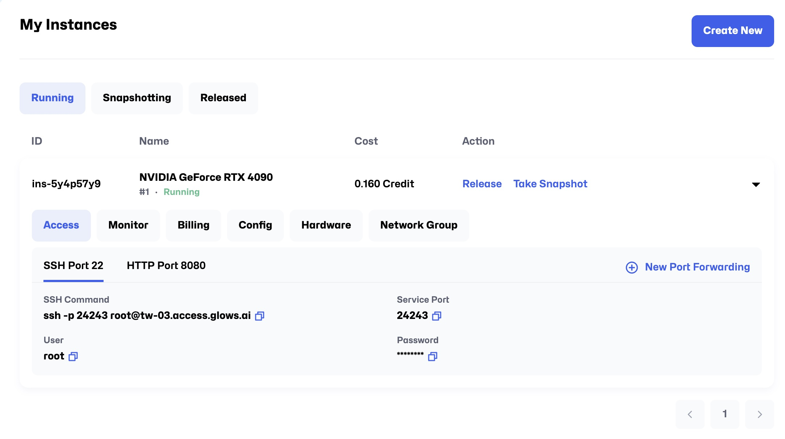
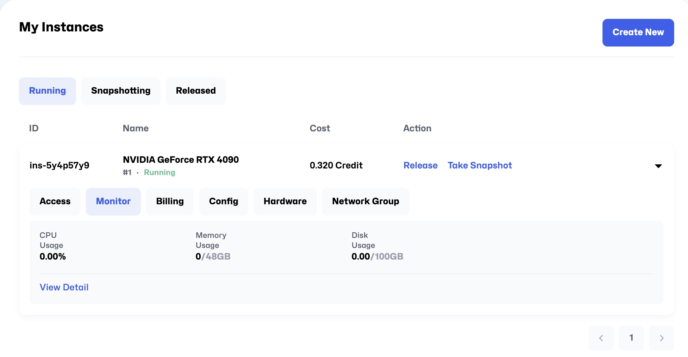
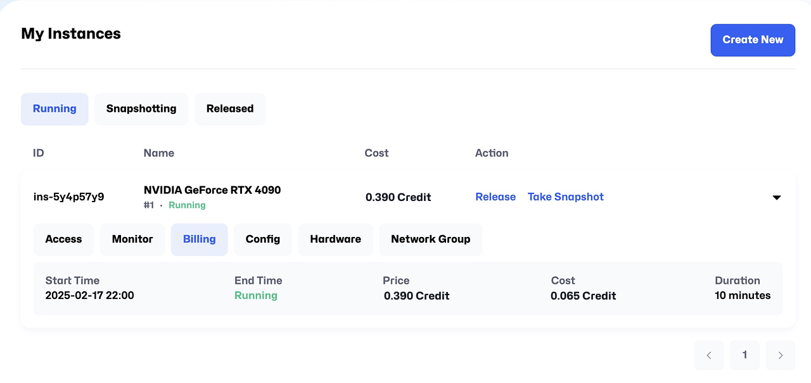
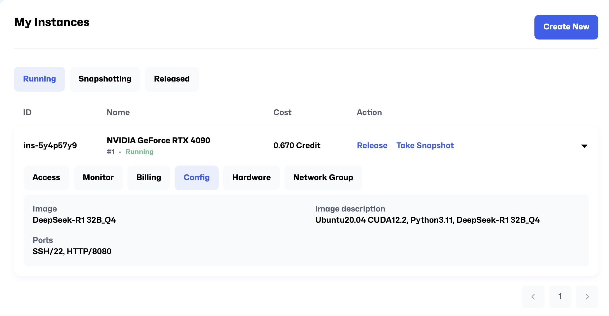
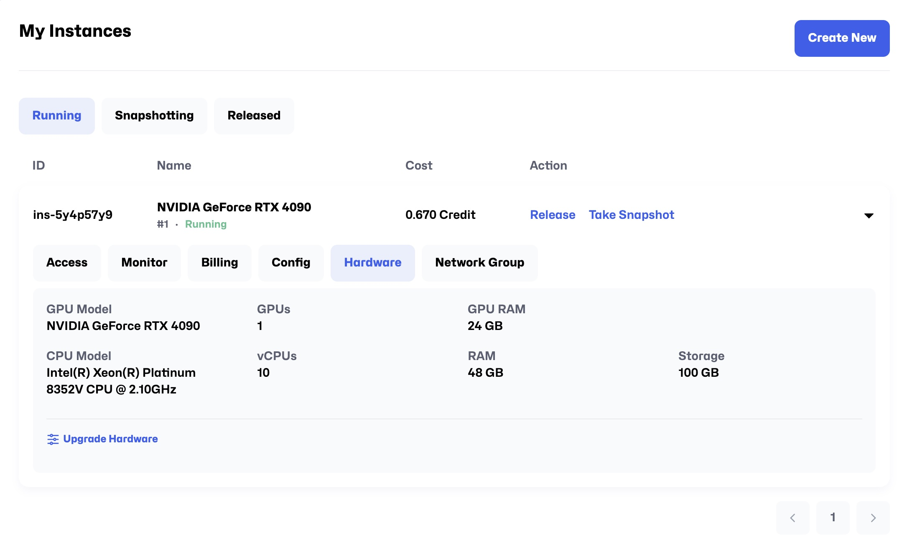
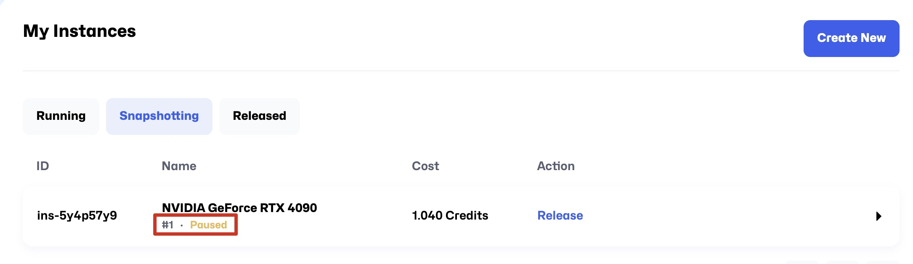
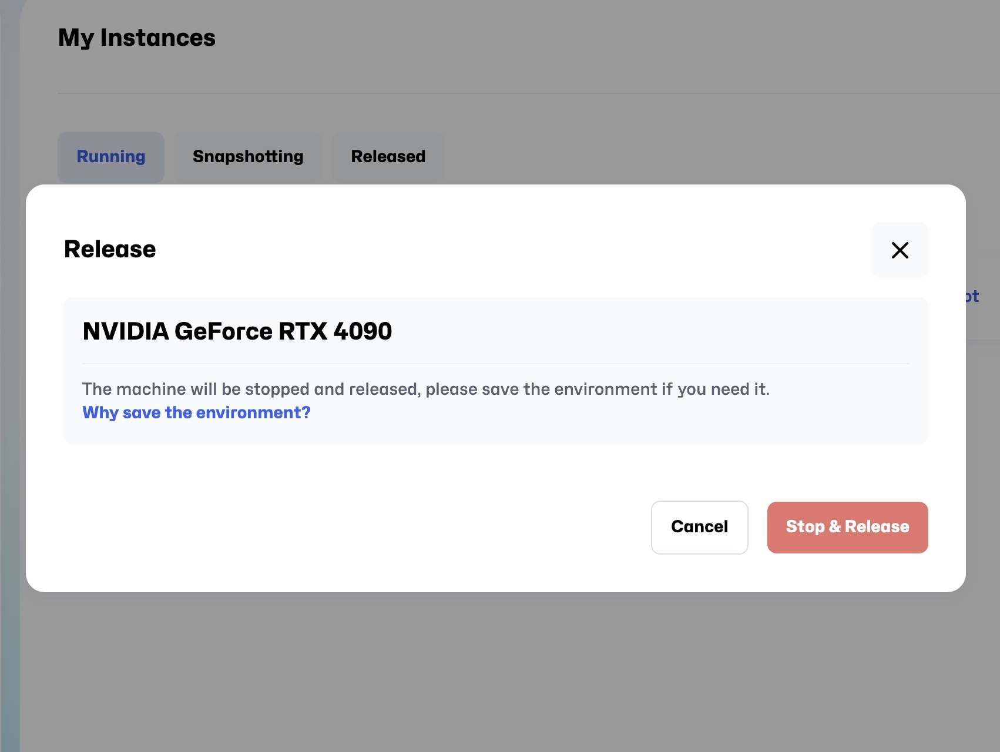

# インスタンス管理

On the **My Instance** page, you can view and manage the status and configuration of all instances. Below is a detailed introduction to the features:

---

## **Instance Status**

On the **My Instance** page, you can see three instance statuses:

1. **Running**: The instance is currently running and accessible for management or use. ⚠️ **Charges apply only when the instance is in this state**, so please manage your usage time carefully.
2. **Snapshotting**: The instance is in the process of creating a snapshot and temporarily unavailable for other management actions. This state **does not incur additional charges**.
3. **Released**: The instance has been released and its resources reclaimed. Instances in this state **cannot be restarted and will no longer incur charges**.

**Each status has an instance list with the following columns:**

- **ID**: The unique identifier of each instance.
- **Name**: The name of the instance, which helps users identify it.
- **Cost**: The billing status and accumulated cost of the current instance.
- **Action**: The operations that can be performed on the instance (see the operations section below).

## **Tabs**

Click on a row in the instance list to view and manage the corresponding instance through the following tabs:

### **1. Access**

- **SSH Port 22**

  - View SSH connection details:

    - **SSH Command**: `ssh -p <Service Port> root@<Access URL>`
    - **Service Port**: The service port for this instance.
    - **User**: Default username is `root`.
    - **Password**: Initial password (masked).

- **HTTP Port 8888**
  This port by default deploys the JupyterLab service. Click **Open** to directly access the instance.

  - Available actions:

    - **Link**: Quick link to the HTTP address.
    - **Open**: Open the link in a new browser tab.
    - **Copy**: Copy the HTTP address.
    - **Edit**: Edit port settings (if available).
    - **Delete**: Remove the port configuration.

- **New Port Forwarding**: Click this button to add a new port forwarding rule by filling in the following:

  - **Service Port**: Set the service port.
  - **Protocol**: Choose the service protocol type, default is TCP. If forwarding a web service (e.g., JupyterLab, Dashboard), check `HTTPS` to enable encrypted access (HTTPS) for browser connection security.

### **2. Monitor**

Real-time performance and resource usage monitoring of the instance.

### **3. Billing**

Displays all billing details related to the instance.

### **4. Config**

View instance configuration, such as image-related parameter settings.

### **5. Hardware**

Check hardware configuration of the instance, including GPU/CPU models, memory, and storage.

### **6. Network Group**

View cluster network information of the instance. Glows.ai supports multi-node multi-GPU operations. You can add multiple instances into the same cluster within Mesh, enabling instances to communicate via internal IPs for more efficient collaborative computing.

---

## **Actions Available When Instance Status is Running**

In the Action column, you will find two buttons: `Take Snapshot` and `Release`.

### **1. Take Snapshot**

- **Function**: Create a snapshot of the current instance, saving all states and file changes except those in `/datadrive`, including installed packages, system settings, and other directory modifications.
- **Use Cases**:

  - When you have made significant customizations (e.g., installed Python packages, Ubuntu software) and want to save the current state for quick restoration.
  - To serve as a base template for creating new instances later, avoiding repetitive setup.

#### **Detailed Take Snapshot Procedure**

1. **Click the `Take Snapshot` button in the Action column to open the snapshot creation window.**

2. **Fill in snapshot details:**

   - **Name**: Enter a name for the snapshot.
   - **Automatic release of machine after successful saving**:
     If selected, the instance will be automatically released after snapshot creation;
     if not selected, the instance will automatically return to the **Running** state and remain available.

3. **Monitor the snapshot progress:**

   - During saving, the instance will show under the **Snapshotting** tab with status changes:

     - **Suspending** → **Paused** → disappears from the list.

     

     

   - After saving completes, the instance will no longer appear on the **My Instance** page and will be stored as a snapshot viewable in the **Snapshots** page.

4. **Post-snapshot effects:**

   - During snapshot saving, the instance is paused. After completion, it will either automatically resume or be released depending on the auto-release selection.

#### **Notes**

- The instance is temporarily unavailable during snapshot saving and can only be operated again once the connection is restored.
- Ensure you have sufficient personal storage space before creating snapshots.

---

### **2. Release**

- **Function**: Release the instance resources and change its status to **Released**.
- **Use Case**: When you no longer need the instance, releasing it will reclaim resources and stop billing.

#### **Detailed Release Procedure**

1. **Click the `Release` button in the Action column to open a confirmation dialog.**

2. **Confirm release:**

   - The system will warn about data deletion and irreversibility.
   - Click `Stop & Release` to confirm.

3. **Status updates during release:**

   - The instance status will change to **Releasing** and eventually to **Released**.

4. **How to launch a new instance from a Snapshot:**
   Select the Snapshot when creating a new instance, then start the instance.

   - After snapshot creation:
     If you did not select auto-release, the instance remains **Running** in the My Instance page; otherwise, it is automatically released.

   

#### **Note:** During snapshot creation, the instance is inaccessible and running programs are interrupted. It is generally recommended to create snapshots before releasing the machine after use.

---

## **Summary of Important Notes**

1. **Restrictions in Snapshotting and Released States:**

   - In these states, only the **Config** and **Hardware** tabs are accessible; other operations are disabled.

2. **Recommendations for Release and Snapshots:**

   - Confirm if you need to retain data before releasing an instance.
   - Regularly creating snapshots helps safeguard important data.

3. **Impact of Operations:**

   - Some actions (such as snapshotting and releasing) may interrupt normal instance use; please schedule accordingly.
