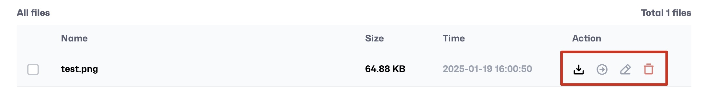

# Data Drive （ データドライブ）

**Data Drive** ページでは、直感的な操作画面を通じてデータファイルを管理できます。ページには異なるリージョンのタブが表示されます：

1. **TW-01**
2. **TW-02**

各タブには関連するファイルやフォルダが表示され、さまざまな操作機能が提供されます。

---

## **ファイルとフォルダ一覧（File and Folder List）**

タブ内では、すべてのファイルとフォルダを一覧表示し、以下の列があります：

- **Name**: ファイルまたはフォルダの名前
- **Size**: ファイルまたはフォルダのサイズ
- **Time**: ファイルまたはフォルダの最終更新日時
- **Action**: 実行可能な操作ボタン

### **操作ボタン（Actions）**

各ファイルまたはフォルダの行には、以下の操作オプションがあります：

- **Download**: 指定したファイルをダウンロード

  > **Note**: この機能はファイルのみ対応しており、フォルダは直接ダウンロードできません。

- **Move**: ファイルまたはフォルダを別の場所に移動

- **Edit**: 名前を変更

- **Delete**: 指定したファイルまたはフォルダを削除

---

## **右側ツールバーの操作（Toolbar Actions）**

タブの右側ツールバーでは、以下のボタンを使用できます：

### **1. Delete**

- **機能**: 選択したファイルまたはフォルダを削除
- **使用条件**: 少なくとも1つのファイルまたはフォルダを選択する必要があります。選択していない場合、ボタンはクリックできません。

### **2. Move**

- **機能**: 選択したファイルまたはフォルダを別の場所に移動
- **使用条件**: 少なくとも1つのファイルまたはフォルダを選択する必要があります。選択していない場合、ボタンはクリックできません。

### **3. Refresh**

- **機能**: リストを更新し、最新のファイル・フォルダ状態を表示

### **4. New Folder**

- **機能**: 新しいフォルダを作成
- **Procedure**:
  1. **New Folder** ボタンをクリック
  2. 表示されたダイアログでフォルダ名を入力
  3. 確認をクリックすると、新しいフォルダがリストに表示されます

### **5. Upload**

- **機能**: 現在のタブの場所にファイルをアップロード
- **Procedure**:
  1. **Upload** ボタンをクリック
  2. アップロードするファイルを選択
  3. アップロード完了後、ファイルがリストに表示されます

---

## **注意事項**

1. **ファイルとフォルダの操作**:

   - フォルダは直接ダウンロードできませんのでご注意ください。
   - 削除または移動操作を行う場合は、必ず対象の項目を選択してください。

2. **命名規則**:

   - 名前を編集する際は、特殊文字や重複した名前を使用しないでください。

3. **ファイルサイズの制限**:
   - ファイルをアップロードする際は、システムで許可されている最大サイズを超えていないか確認してください。

以上が **Data Drive** ページの機能説明です。さらにサポートが必要な場合は、関連操作マニュアルをご参照ください。
