# Glows.ai へのカスタム Docker イメージのアップロード

本チュートリアルでは、ローカルの Docker イメージを Glows.ai にアップロードして使用する方法をステップごとに解説します。イメージの準備、パッケージ化、アップロード、インスタンス作成までを一通り実演します。

## Docker イメージ tar パッケージの作成

Glows.ai で正常にイメージを動作させるには、以下の点に注意してください：

- イメージの **ENTRYPOINT** は常に実行状態を維持する必要があります（コンテナが自動で終了しないようにするため）
- SSH サービス をインストールして起動する（インスタンスへのアクセスを容易にするため）
  
### 設定の説明

ENTRYPOINT として独立した `.sh` スクリプトを作成することを推奨します。例えば `run_glowsai.sh` のようにし、コンテナ起動時に自動で実行したいコマンド（SSH サービスやカスタムサービスなど）を記述します。以下は例です：

```bash
#!/bin/bash
# Start SSH service
echo "Starting SSH service..."
/usr/sbin/sshd -E /root/.ssh/sshd_running.log

# Custom Command
echo "hello glowsai" > /hello.txt

# Keep the container running
echo "Container running..."
tail -f /dev/null
```

同時に、Dockerfile に SSH のインストールと設定、ENTRYPOINT の指定を追加します：

```bash
# Install and configure SSH server
RUN apt-get update && apt-get install -y openssh-server && \
    mkdir /var/run/sshd /root/.ssh && sed -ri 's/^#?PermitRootLogin\s+.*/PermitRootLogin yes/' /etc/ssh/sshd_config && \
    sed -ri 's/UsePAM yes/#UsePAM yes/g' /etc/ssh/sshd_config && \
    apt-get clean && \
    rm -rf /var/lib/apt/lists/* /tmp/* /var/tmp/*

# Copy and set permissions for the start script
COPY run_glowsai.sh /usr/bin/
RUN chmod +x /usr/bin/run_glowsai.sh
EXPOSE 22
# Set entrypoint
ENTRYPOINT ["/usr/bin/run_glowsai.sh"]
```

### ローカル操作手順例

ローカルの Docker イメージを Glows.ai にアップロードする場合、イメージ内に SSH がインストールされ起動しており、ENTRYPOINT が常時実行される設定になっていることを確認してください。未設定の場合は、以下の手順で操作します：

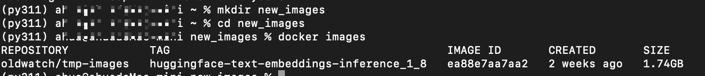

1. `new_images` というディレクトリを新規作成し、そのディレクトリ内に `run_glowsai.sh` を作成します。内容は以下の通りです：

```bash
#!/bin/bash
# Start SSH service
echo "Starting SSH service..."
/usr/sbin/sshd -E /root/.ssh/sshd_running.log

# Custom Command
echo "hello glowsai" > /hello.txt

# Keep the container running
echo "Container running..."
tail -f /dev/null
```

> 注意：`# Custom Command` には、自動起動させたいコマンドを記入できます。その他の部分は変更しないでください。変更するとコンテナが正常に起動しなくなる可能性があります。

2. `Dockerfile` を作成し、以下の内容を入力します：

```bash
# Set the base image
FROM oldwatch/tmp-images:huggingface-text-embeddings-inference_1_8

# Install and configure SSH server
RUN apt-get update && apt-get install -y openssh-server && \
    mkdir /var/run/sshd /root/.ssh && sed -ri 's/^#?PermitRootLogin\s+.*/PermitRootLogin yes/' /etc/ssh/sshd_config && \
    sed -ri 's/UsePAM yes/#UsePAM yes/g' /etc/ssh/sshd_config && \
    apt-get clean && \
    rm -rf /var/lib/apt/lists/* /tmp/* /var/tmp/*

# Copy and set permissions for the start script
COPY run_glowsai.sh /usr/bin/
RUN chmod +x /usr/bin/run_glowsai.sh
EXPOSE 22
# Set entrypoint
ENTRYPOINT ["/usr/bin/run_glowsai.sh"]
```

3. ディレクトリ内で以下のコマンドを実行し、新しいイメージをビルドします：

```bash
docker build -t new_images:huggingface-text-embeddings-inference_1_8 .
```

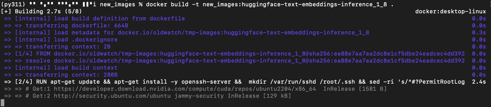

4. ビルドに成功したら、`docker save` を使用してイメージを tar ファイルとして保存します：

```bash
docker save -o <output_file_path> <image_name_or_id>
```

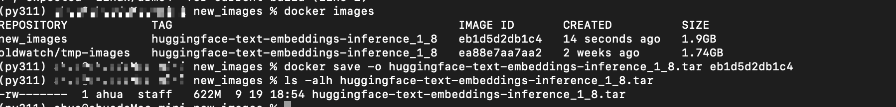

## Docker イメージ tar パッケージのアップロード

1. Glows.ai の **Images** ページを開き、`Upload Image` をクリックします。
2. イメージの説明を入力します。**Select Image** をクリックして、先ほど作成した tar パッケージをアップロードします。

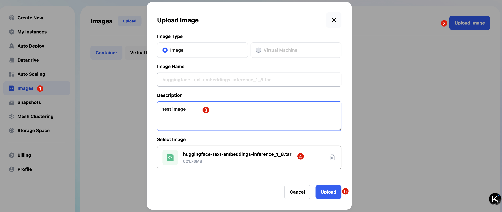

3. アップロード中は進捗が表示され、アップロード完了後に Glows.ai 上で使用できるようになります。

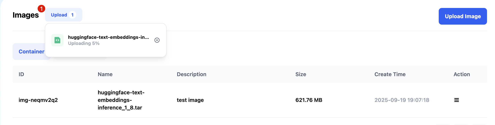

## インスタンスの作成

1. インスタンスを作成する際に **My Images**を選択すると、先ほどアップロードしたイメージが表示されます。選択後、必要に応じて Datadrive をマウントしてからインスタンスの作成を完了してください。

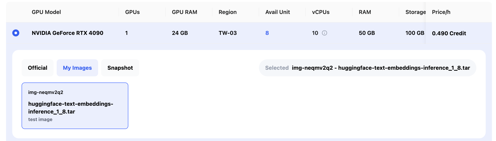

2. インスタンス起動後、エクスポートする必要のあるポートを手動で設定します。例として、SSHサービスはポート22：

   - `New Port Forwarding` をクリック
   - **Service Port** を 22 に設定
   - **HTTPS はチェックしない**
   - `Create` をクリックしてポートのエクスポートを完了します

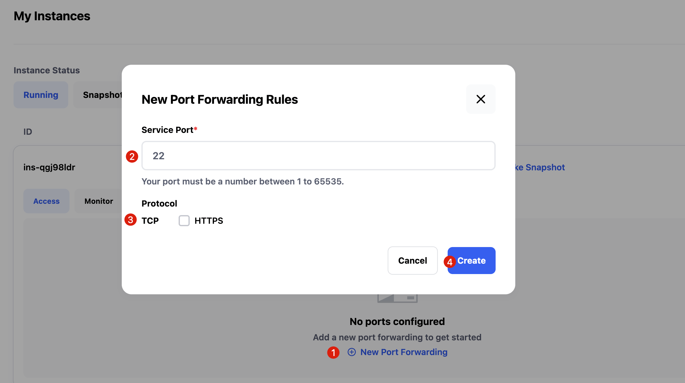

3. 設定完了後、約10～20秒でポートマッピングが完了します。インターフェースにSSH接続情報とパスワードが表示されるので、ローカルからログインして操作できます。

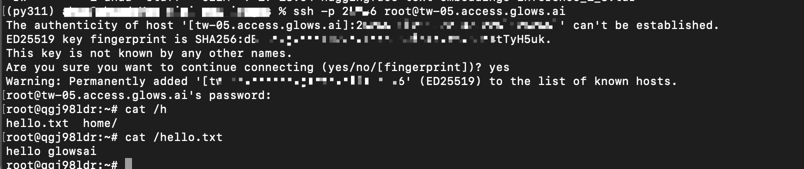

4. もしインスタンスで他のサービスを運行しており、パブリックネットワークからアクセスする必要がある場合は、ポートマッピングを追加できます。HTTPサービスの場合は、HTTPSにチェックを入れる必要があります。

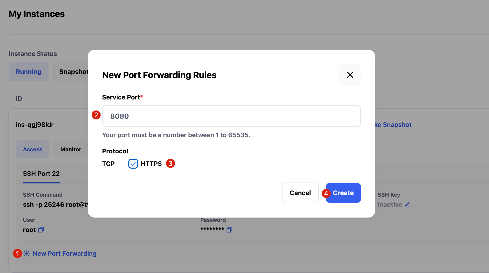

5. HTTPサービスを例として、サービスをポート8080で起動すると、インスタンスのインターフェース上の対応するリンクからサービスにアクセスできます。

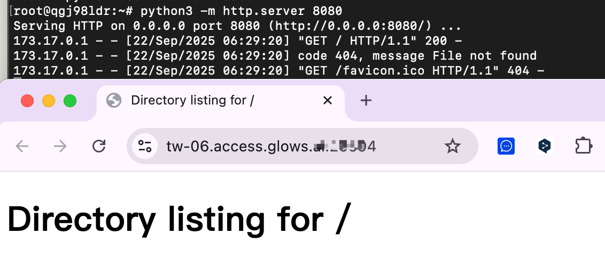

6. 環境やファイルの変更が完了したら、スナップショットを作成するか、不要になった場合はインスタンスを直接リリースできます。

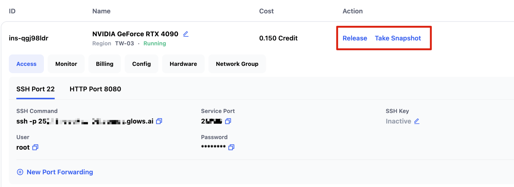

---

# お問い合わせ

**Glows.ai** のご利用中に何かご不明点やご意見がございましたら、Email、Discord、または Line でお気軽にご連絡ください。

**Email:** [support@glows.ai](mailto:support@glows.ai)

**Discord:** [https://discord.com/invite/glowsai](https://discord.com/invite/glowsai)

**Line:** [https://lin.ee/fHcoDgG](https://lin.ee/fHcoDgG)
