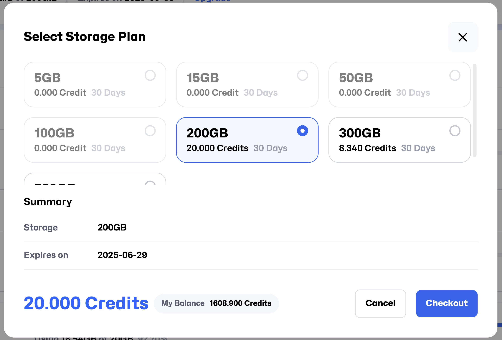

# ストレージ管理

**Space Management** ページでは、ストレージリソースを一元的に管理し、柔軟なプラン調整と容量の割り当てを通じて、リソースを最大限に活用できます。
 以下は、機能の概要と操作ガイドです：

---

## **スペースストレージ**

ページ上部には **Space Storage** の使用状況バーが表示され、現在の利用状況をわかりやすく確認できます。
例：

- **Using 6.63GiB of 50GiB**
- **Expires on 2025-01-24**
  

### **ストレージプランのアップグレード**

`Upgrade` ボタンをクリックすると、**Select Storage Plan** ページに移動します。  
 ここで異なる容量のプランを選択でき、プランごとに必要な **Credit** が差し引かれます。  
 すべてのプランの有効期間は **30日間** です。  
 
プランを選択すると、下部に **Summary** が表示されます：

- **Storage**：選択したストレージプランの詳細
- **Expire**：プランの有効期限
- **Total Price**：合計価格

### **料金調整について**

- **Upgrade Plan**（アップグレード）：現在のプランと新しいプランの価格差をもとに、1日あたりの料金調整が行われます。
- **Downgrade Plan**（ダウングレード）：価格差の返金は行われません。

プランを選択後、`Charge` ボタンでチャージするか、`Modify Plan` ボタンで必要な Credit を直接差し引くことができます。

## **クォータ（Quota）**

`Modify` ボタンをクリックすると、**Snapshot** および **Data Drive** の使用可能なストレージ容量を調整できます。

調整後、ページ上には Snapshot と Data Drive の個別のストレージ使用状況が表示されます。例：

- **Using 0.00GB of 3GB 0.00%**

