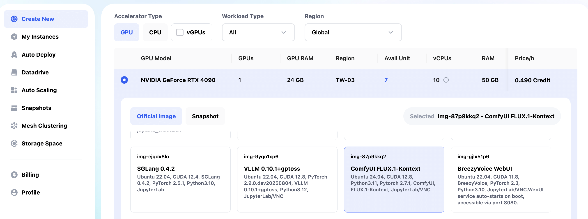
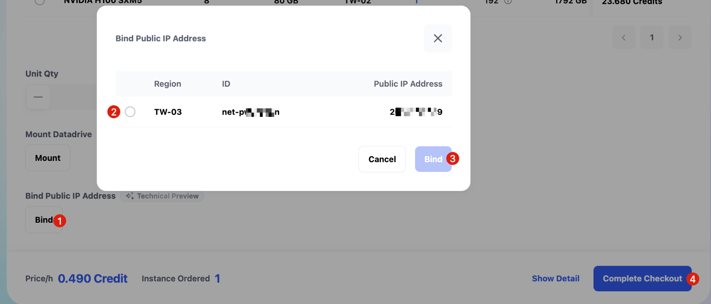
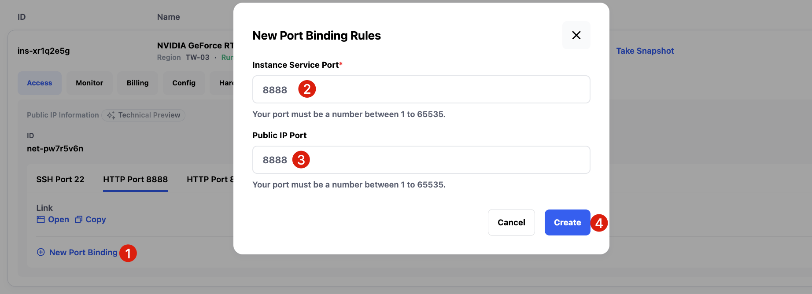
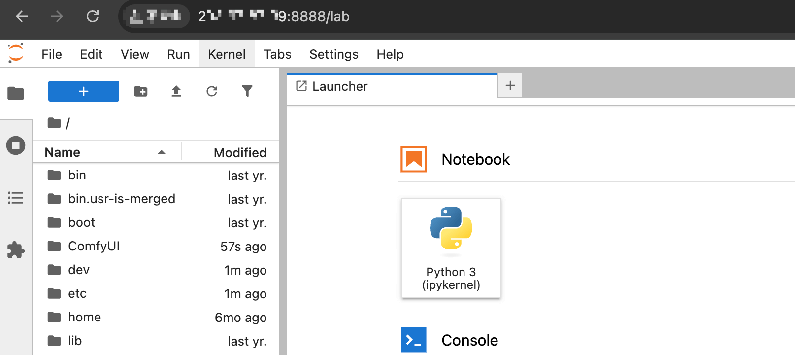
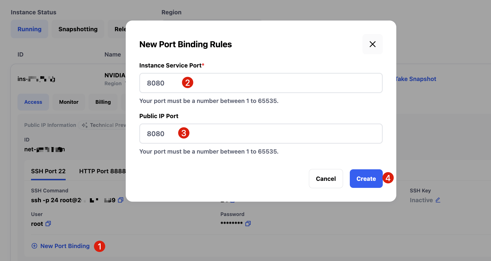
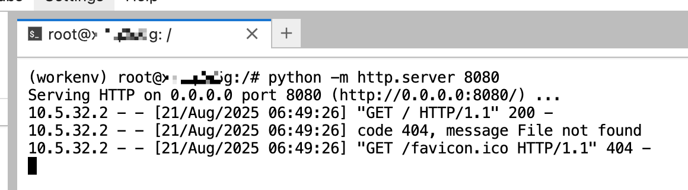
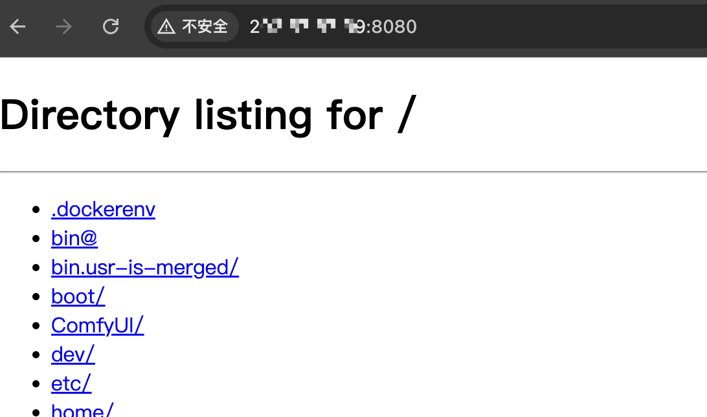

# Bind Public IP（パブリックIP割り当て）

**Bind Public IP** は **Glows.ai** の最新機能で、現在ベータテスト段階にあります。  
 ご利用希望の場合は、本文末の連絡先を通じて申請してください。  
 以下では、その使用方法について説明します。  

---

## 利用開始後の手順

**Bind Public IP** 機能を有効にすると、インスタンスの作成手順はこれまでとほぼ同じです。 まず、使用したいイメージを選択します。

これまでと異なる点は、`Bind` ボタンをクリックして、インスタンスに固定IPを割り当てられることです。 クリック後、画面の案内に従ってシステムが割り当てた固定IPを選択し、`Complete Checkout` を押すと、固定IP付きのインスタンスを作成できます。

---

## ポートマッピングの確認と変更

インスタンスを作成すると、画面に一部のデフォルトサービスへのアクセスリンクが自動で表示されます。  
 ただし、デフォルトで割り当てられる HTTP ポート番号が低いため、ブラウザで直接アクセスすると「読み込みできません」という警告が出る場合があります。  
 これはブラウザのセキュリティポリシーにより、IPアドレス＋低番号ポートへのアクセスが制限されているためです。  
 
その場合は、下図のように **New Port Binding** をクリックし、インスタンス内の 8888 ポートを固定IPの 8888 ポートにマッピングします。  

設定が完了すると、`StaticIP:8888` からインスタンス内でデフォルト起動している **JupyterLab** にアクセスできます。他の独自サービスも同様の手順で設定可能です。

 例：**ComfyUI** の 8188 ポートを固定IPの 8188 にマッピングすることで、そのアドレスからサービスにアクセスできます。

---

## カスタムポートの追加

デフォルトサービス以外にも、独自に構築したサービス用のポートを追加することができます。 画面で **New Port Binding** をクリックし、新たに 8080 ポートを作成し、固定IPの 8080 ポートにマッピングします。

その後、インスタンス内で 8080 ポートをリッスンするシンプルな HTTP サービスを起動します。

サービスが起動すると、ブラウザから `StaticIP:8080` にアクセスするだけで利用可能になり、非常に便利です。

---

## 独自ドメインのバインド

さらに、固定IPを自分のドメインに解決し、独自ドメインを通じて関連サービスに直接アクセスすることも可能です。

---

## お問い合わせ

**Glows.ai** の利用中に問題が発生した場合やご意見がある場合は、以下の方法でお問い合わせください：

- **Email**: [support@glows.ai](mailto:support@glows.ai)

- **Discord**: [https://discord.com/invite/glowsai](https://discord.com/invite/glowsai)

- **Line**: [https:/lin.ee/fHcoDgG](https:/lin.ee/fHcoDgG)
