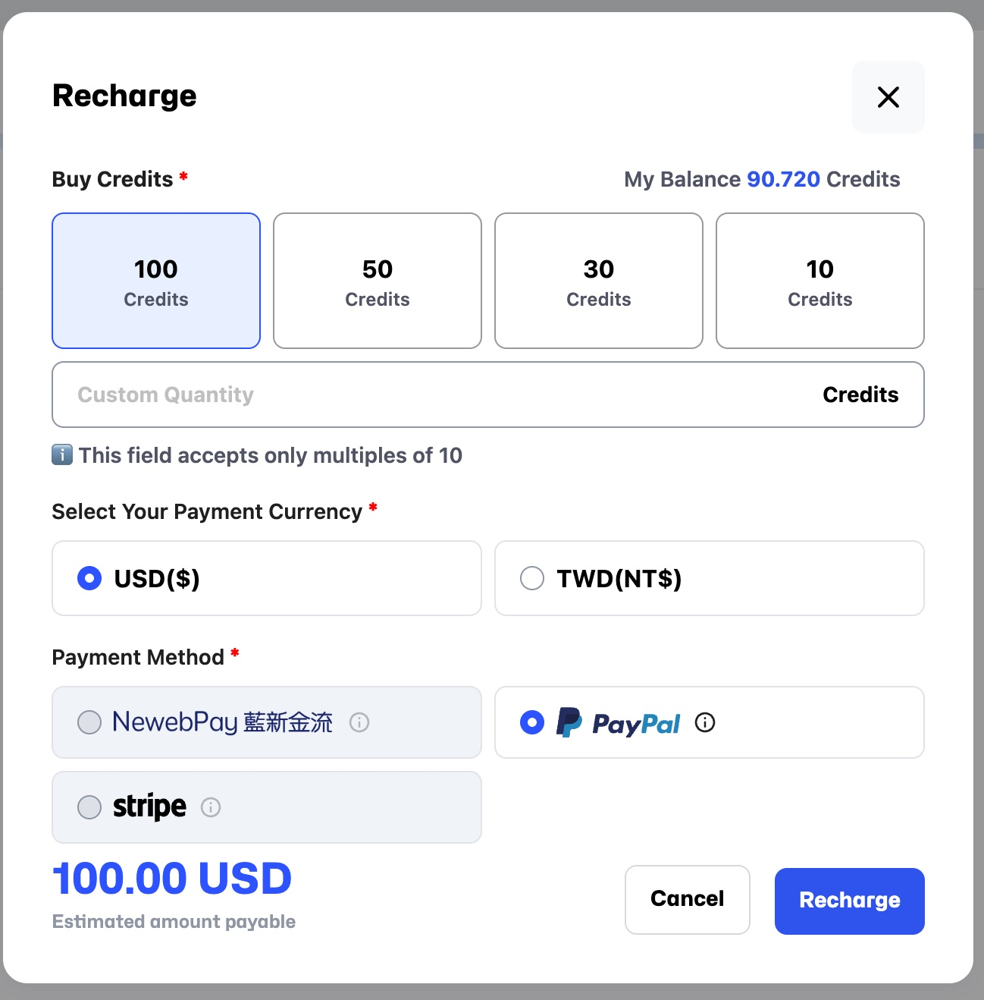

# 請求システム

**Billing** ページでは、支出や残高の確認・管理が可能です。

## **クレジットのチャージ**

1. **My Spending** の右側にある `Recharge` ボタンをクリックします。
2. クリック後、チャージ画面に移動し、**My Balance** と **Buy Credit** のオプションが表示されます。
   > 既定の金額を選択するか、カスタムチャージ金額を入力します。
3. **Payment Currency** を選択します（現在は USD と TWD に対応）。
4. **Payment Method** を選択します（現在は PayPal と NewebPay に対応）。
5. **I have read and agree to the EULA** にチェックを入れます。
6. 表示される金額が正しいことを確認し、**Recharge** をクリックしてチャージを完了します。

## **請求概要**

- **Balance (Credit)**：現在の残高（例：204.160）。矢印をクリックするとチャージ画面に移動します。
- **Total Spending (Credit)**： 総支出（例：195.830）。
- **Total Duration (h)**： 総使用時間（例：17.3 時間）。
- **Invoicing Limit (Credit)**： 現在制限なし。

## **請求履歴リスト**

各取引の詳細情報を表示します： **Time**、**Name**、 **Status**、 **Payment**。

