# Glows.ai團隊版使用教程

Glows.ai 的團隊版功能，將構建團隊協作體系，實現資源集中管理、靈活配額分配、安全共享機制，滿足企業級用戶雲資源共享使用需求。

本教程分為三部分：

- [創建者使用教程](#創建者使用教程)
- [管理員使用教程](#管理員使用教程)
- [普通成員使用教程](#普通成員使用教程)

------

## 創建者使用教程

### 創建團隊

登錄 Glows.ai 平台後，點擊右上角個人信息，在彈框中點擊 `Teams`，然後點擊 `Create Teams` 進入團隊創建流程。


- 首先輸入團隊名稱和簡介，然後點擊 `Next` 進入下一步。

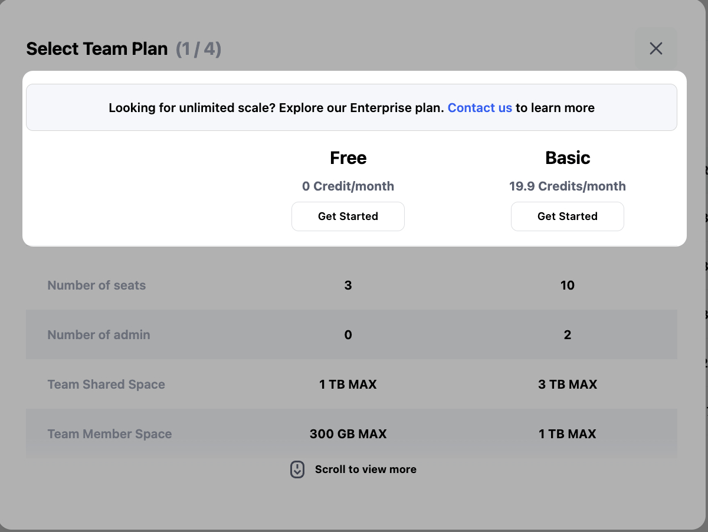

在內測階段，默認初始團隊 Storage 為 0，您創建團隊後可以聯繫我們的小幫手幫您增加 Storage，其他存儲容量套餐會在未來陸續上線。

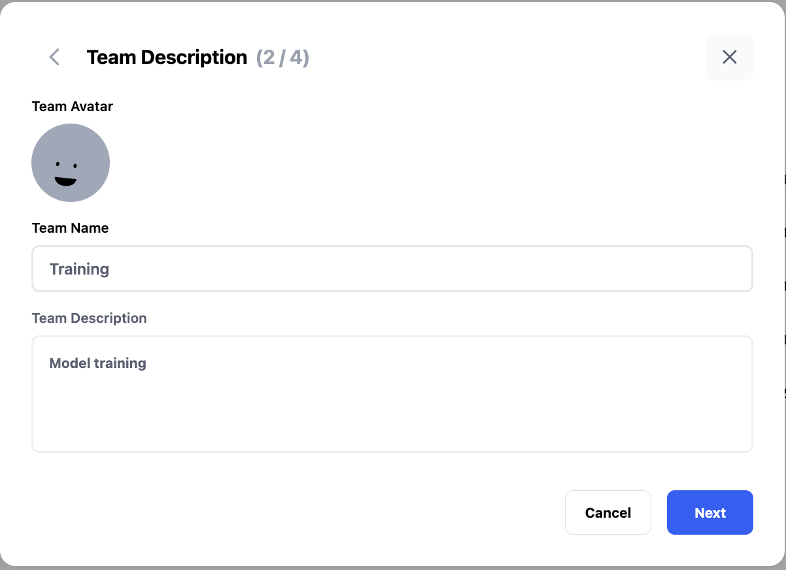

點擊 `Confirm` 後，您會看⾒團隊基本信息，默認會分配⼀個團隊創建者(**Owner**)帳號，您將團隊創建者帳號發送給我們的⼩幫⼿即可配置 Storage 套餐了。

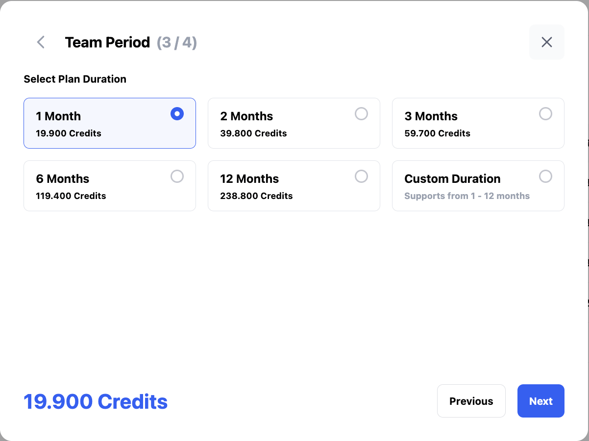

### 切換到團隊介面

團隊創建者可以選擇從 Glows.ai 主網帳號直接切換到團隊版本。按圖示點擊右上角個人信息，在彈框中點擊 `Teams`，然後點擊要進入的團隊。


### 成員管理

創建者或者管理員帳號登錄後，可以點擊左側功能欄的 `Member` tab，進行成員管理，目前支持：添加成員、派發Credits、資源可見性控制、修改成員基本信息、成員實例管理等功能。

#### 添加成員

點擊 `Member` 介面中的 `Add Members` 按鈕進入添加成員流程。

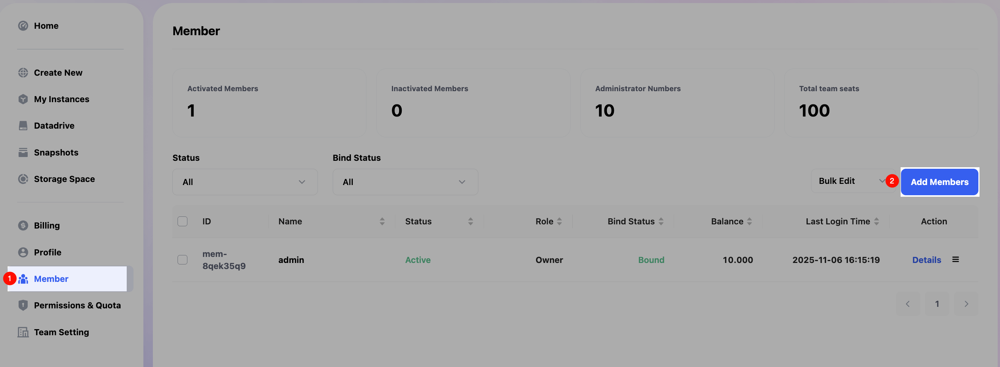

可以設置新成員的：帳號(Login Account)、帳號密碼(Login Password)、角色(Role)、初始額度(Assign Credits)、別名(Alias)、描述說明(Note)。設置完成後點擊介面中的 `Add Member` 按鈕完成成員創建。

角色(Role) 目前支援設置為 Admin(管理員)或者Member(普通成員)。

分配額度(Assign Credits)是給成員用於使用平台初始點數，可以用於租用機器或者購買Storage，也可以創建後再分配。

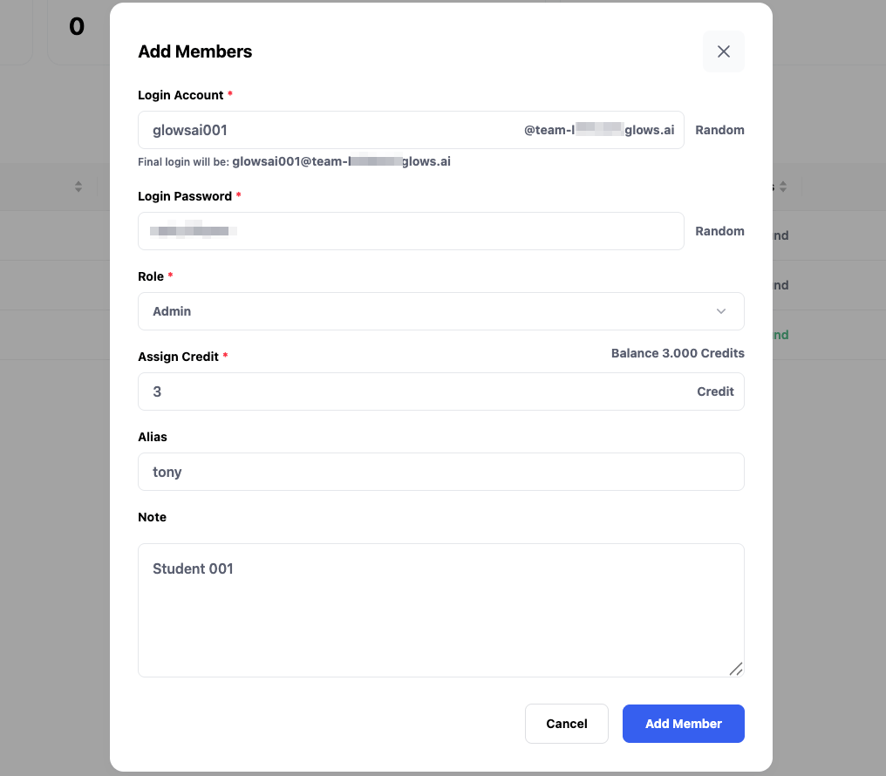

創建成功後，可以點擊 `Copy Login Details` 獲取到新成員信息，然後將信息發送給對應成員。新成員登錄使用方法參考[普通成員登錄方法](#加入團隊)


#### 派發 Credits

在 `Member` 介面中點擊對應成員後的 Action 按鈕，選擇 `Assign Credits`，進入派發 Credits 介面。


輸入派發金額後點擊 `Assign` 完成派發。

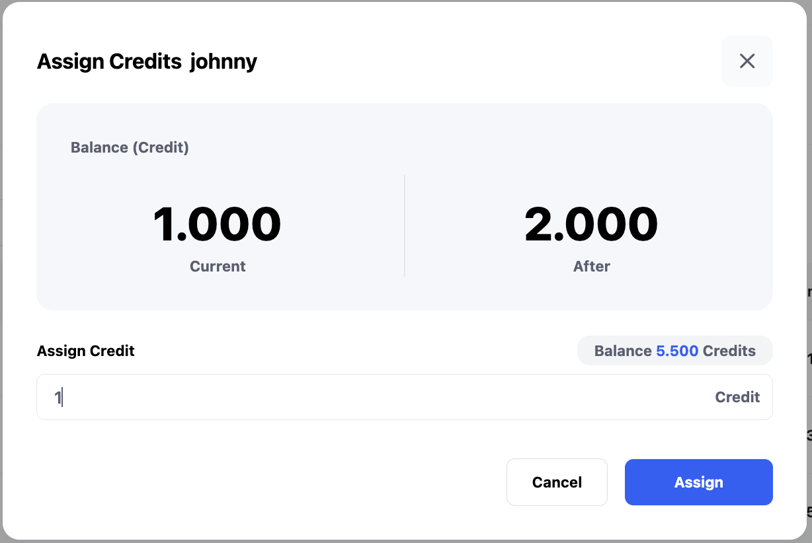

#### 資源可見性控制

在 `Permissions & Quota` 中可以設置團隊成員可以看見哪些顯卡、鏡像、可用實例總數和存儲總空間。

點擊 `Permissions & Quota` 進入權限設置介面，首先可以控制團隊成員可見機器資源，可以控制：機器區域、機器類型、機器型號。圖示權限為：團隊成員只能使用 TW-03區域的 NVIDIA GeForce RTX 4090 機器。

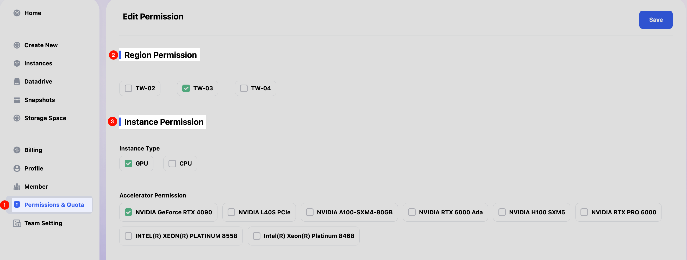

頁面下滑，繼續設置成員可以使⽤哪些官⽅基礎鏡像。圖⽰權限為：隊成員只能使⽤ CUDA12.8 Torch2.7.1 Base 這個鏡像創建實例。

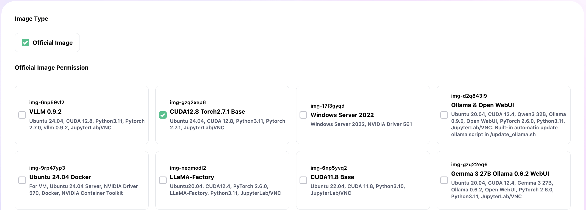

最後還可以設置團隊成員實例資料、Snapshot數量、Storage可⽤空間等。

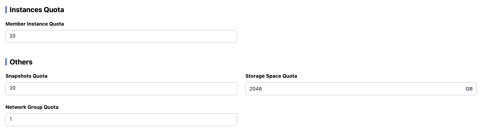

設置完成後，需要點擊右上角的 `Save` 按鈕保存設置，這樣成員在Create New 介面就只能選到您固定的機器類型和環境了。

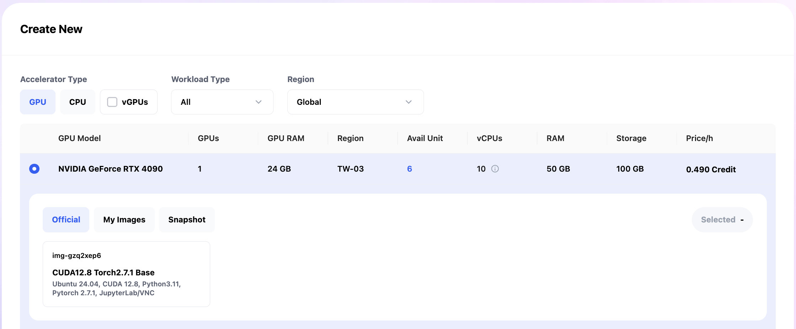

#### 修改成員基本信息

在 `Member` 介面中點擊對應成員後的 `Details` 按鈕可以進入成員詳細面板介面。


目前支持修改成員的 **Name**、**Role**、**Account Balance**、**Note**、**Login Password**。在詳細面板介面還可以看到該成員其他使用信息，比如：剩餘Credits、總花費、實例數量、存儲使用情況等。

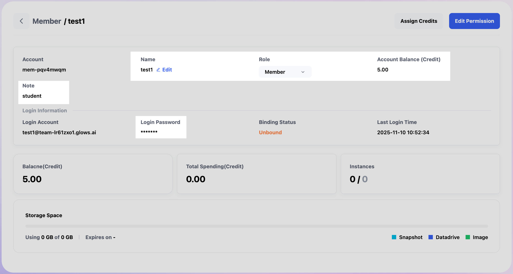

點擊該介面右上角的 `Edit Permission` 按鈕，可以設置單個成員的資源可見性，可以實現讓不同成員看到不同的機器資源和鏡像資源。

#### 成員實例管理

在 `Instances` 介面中點擊 `Admin View`，可以看到所有成員的實例紀錄和運行情況。


點擊想要關閉的成員實例數據條中的 `Action`，再點擊 `Release` 即可直接釋放該成員實例。

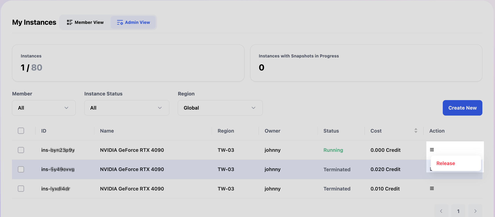

### Storage 管理

在 `Storage Space` 介面選擇 `Admin View`，可以看到團隊 Storage 的使用情況，還有每個團隊成員個人 Storage 的使用情況。

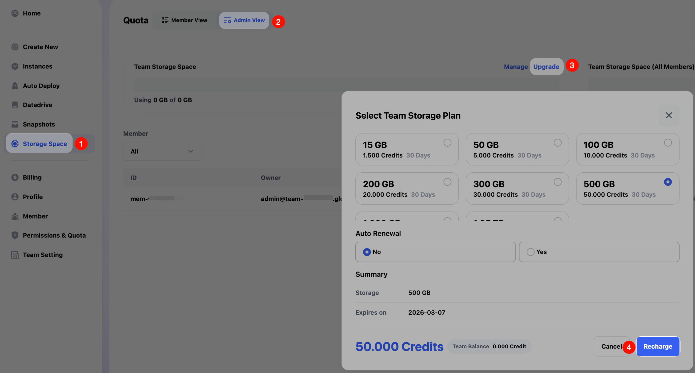

點擊 `Team Storage Space` 的 `Manage` 按鈕，進入團隊 Storage 分配介面，先點擊 `Modify`，然後可以設置 **Datadrive** 和 **Snapshot** 空間額度，最後點擊 `Update` 完成分配。

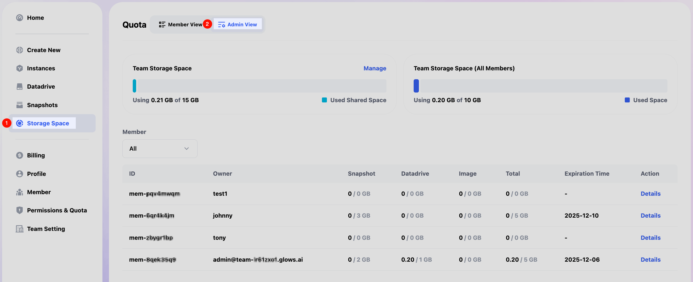

### Datadrive 管理

在 `Datadrive` 介面選擇 `Admin View` ，可以看到團隊 Datadrive 的使用情況，還有每個團隊成員個人Datadrive的使用情況。

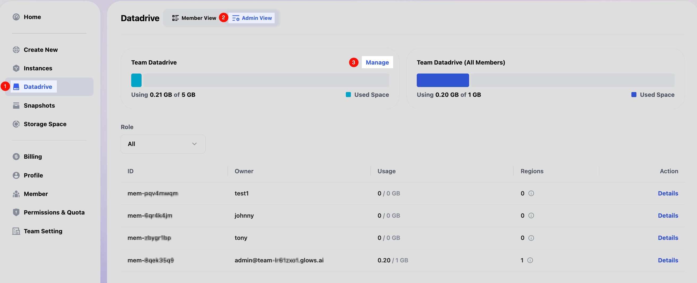

點擊 `Team Datadrive` 的 `Manage` 按鈕，進入團隊 Datadrive 管理介面，只有團隊創建者和管理員有權限向團隊 Datadrive 上傳和刪除數據。

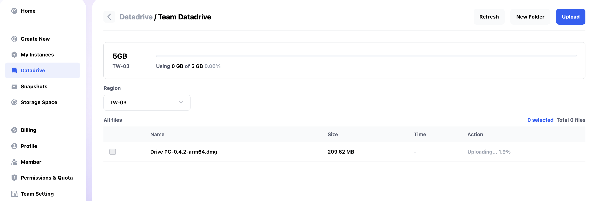

其他成員在創建實例的時候會默認掛載團隊雲端硬碟到實例中的`/team_data`，普通成員只有可讀權限，團隊創建者和管理員有讀寫權限。


### Snapshots 管理

在 `Snapshots` 介面選擇 `Admin View`，可以看到團隊和每個團隊成員個人創建的 Snapshot。

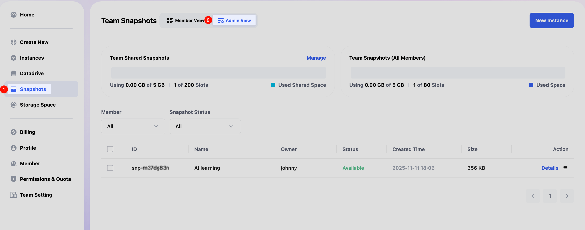

#### 設置團隊 Snapshot

只需要點擊想要轉變到團隊共享的 Snapshot 後的 `Details`，然後再選擇 `Share to team` 即可將成員創建的 Snapshot 變成團隊共享 Snapshot。


#### 使用團隊 Snapshot

其他成員創建實例的時候，選擇 Snapshot，就可以看到團隊共享環境了，團隊共享環境右上角也會有一個 **Team** 標記。


#### 管理團隊 Snapshot

在 `Snapshots` 介面選擇 `Admin View` 後，點擊 `Team Shared Snapshots` 模塊右上角的 `Manage` 按鈕，即可進入管理團隊 Snapshot 介面。

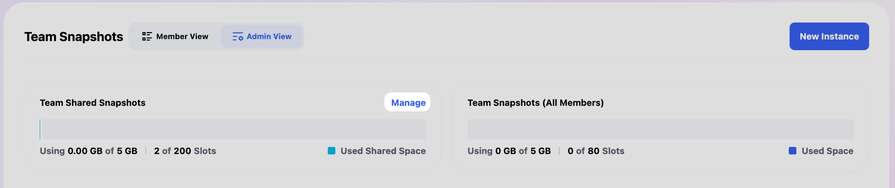

在這個介面可以看到所有團隊 Snapshot，目前只支持刪除操作，選擇不需要的 Snapshot 點擊 `Action` 中的 `Delete` 按鈕即可刪除。

**注意：** 團隊Snapshot執行刪除操作後，會徹底刪除，無法找回，請謹慎操作。


### Billing 管理

在 `Billing` 介面選擇 `Admin View`，可以看到團隊所有成員的賬單數據。帳單查詢支援依成員與帳單類型進行篩選。

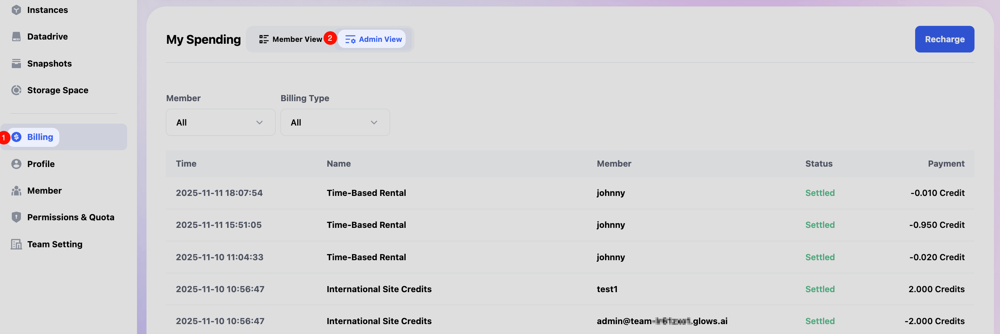

同時在 `Billing` 介面可以點擊 `Recharge` 按鈕進行儲值。

**注意：**目前團隊中儲值功能只有團隊創建者有，需要先有團隊創建者儲值後，分發給團隊管理和普通成員。

### 團隊信息編輯

在`Team Setting`介面點擊右上角的`Edit`按鈕，可以編輯團隊的名稱和描述信息。

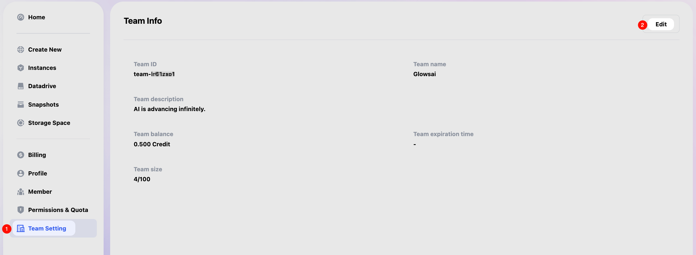

## 管理員使用教程

管理員除了不能創建團隊和儲值外，其他權限和團隊創建者一樣，請參考**團隊創建者使用教程內容**。

## 普通成員使用教程

普通成員僅支持以下功能：創建實例（Create New）、實例管理(Instances)、Datadrive管理(Datadrive)、Snapshot管理(Snapshots)、Storage管理(Storage Space)、帳單查詢(Billing)、個人信息修改(Profile)，和Glows.ai主網操作一致，具體請看[Glows.ai使用手冊](https://docs.glows.ai/docs/create-new)。


### 加入團隊

普通成員拿到團隊創建者或管理員創建的成員帳號後可以從兩個入口加入團隊。

#### 1> 團隊版本連結登入

瀏覽器訪問下面團隊登錄介面，輸入團隊賬號密碼。

```bash
https://platform.glows.ai/team/login
```


#### 2>  Glows.ai 主網進入

登錄 Glows.ai 主網後，點擊右上角個人頭像，選擇 **`Teams`->`Join Team`**。

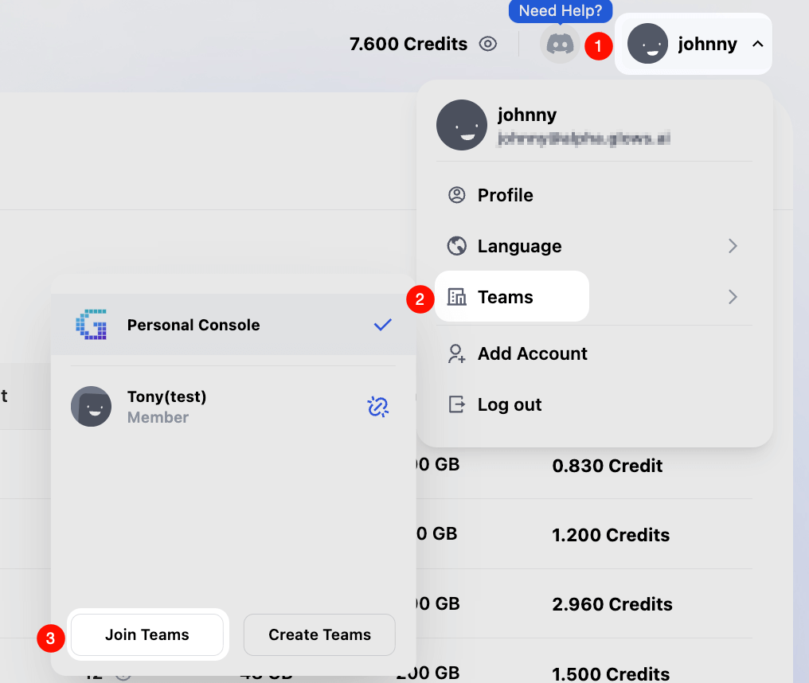

在 Join Team 介面輸入團隊賬號密碼，即可將Glows.ai主網賬號和團隊賬號綁定，後面就可以直接在主網切換到團隊了。


不論用哪一種方式登入，首次登錄後會需要重置密碼。

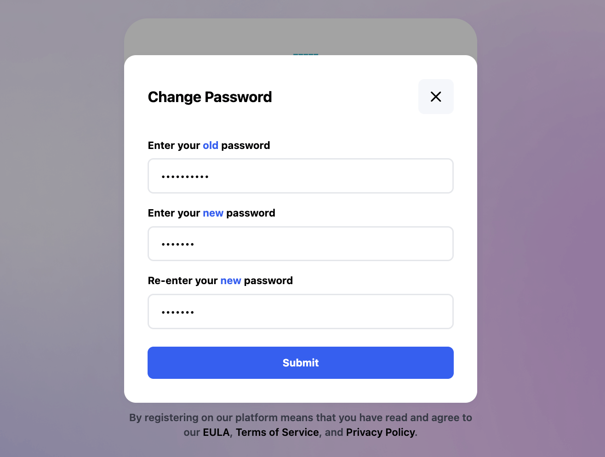

### 獲取Credits

團隊成員如果需要 Credits，請向團隊創建者或者管理員申請。

### 創建實例

點擊 `Create New`，選擇自己需要租用的顯卡和環境。

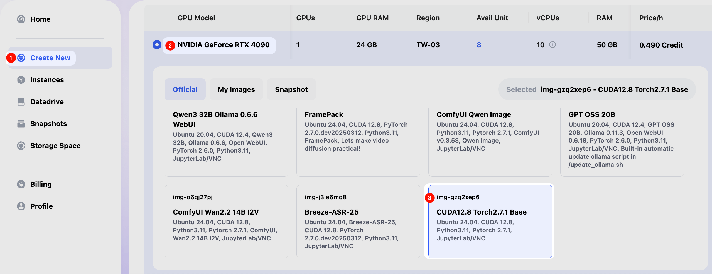

下滑可以看到 Datadrive 相關配置，設置好後點擊 `Complete Checkout` 即可完成實例創建。

- **Unit Qty:** 租用顯卡數量，如果設置為2，則表示租用2張顯卡
- **Mount Personal Datadrive:** （可選擇）可以選是否掛載個人Datadrive
- **Mount Team Datadrive:** （默認）自動掛著團隊網盤到實例中的 `/team_data` 目錄下，普通成員只有可讀權限
- **Bind Public IP Address:** 綁定固定IP，如有需要請聯繫Glows.ai小幫手

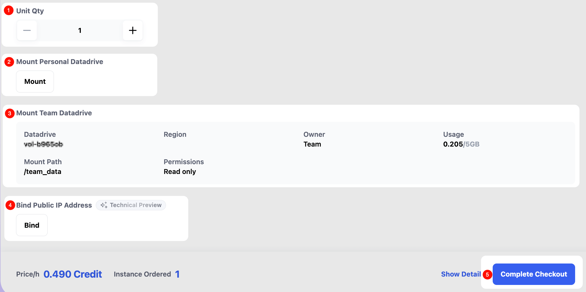

### 實例管理

實例啟動成功後，可以在 Instances 介面看到新啟動的實例，點擊實例可以看到實例更詳細的信息和更多操作。

- **Access:** 實例的訪問信息，比較常用的是 SSH(Port 22) 和 Jupyterlab(Port 8888)
- **Monitor:** 實例CPU、GPU資源監控
- **Billing:** 實例費用明細
- **Config:** 實例配置說明（實例啟動鏡像軟體說明）
- **Hardware:** 實例硬件配置說明

使用完成後，可以在 `Action` 中可以選擇 `Release` 釋放實例，或者 `Take Snapshot` 創建一個快照。

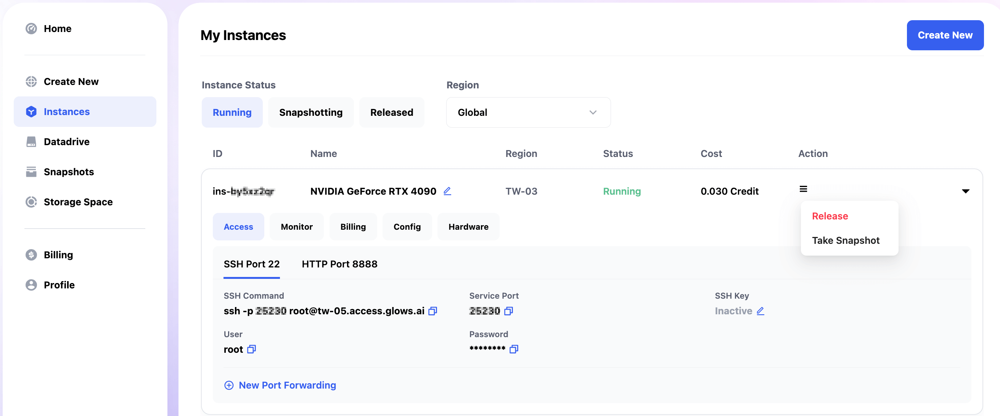

### 其他功能

Datadrive管理(Datadrive)、Snapshot管理(Snapshots)、Storage管理(Storage Space)、帳單查詢(Billing)、個人信息修改(Profile)與主網操作一致，請參考一下教程內容：[Glows.ai使用手冊](https://docs.glows.ai/docs/create-new)

## 聯繫我們

如果您在使用 Glows.ai 的過程中有任何疑問或者建議，歡迎通過郵件、Discord或者Line聯繫我們。

**Email:** [support@glows.ai](mailto:support@glows.ai)

**Discord:** [https://discord.com/invite/glowsai](https://discord.com/invite/glowsai)

**Line:** [https://lin.ee/fHcoDgG](https://lin.ee/fHcoDgG)
