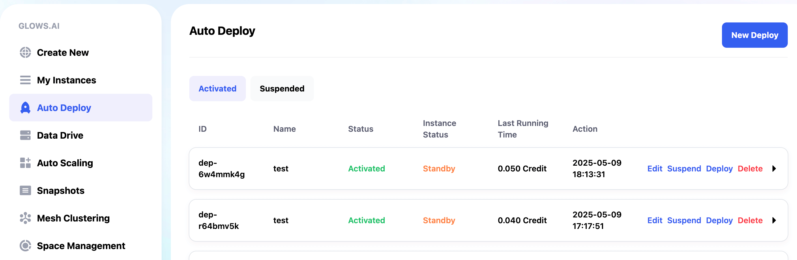
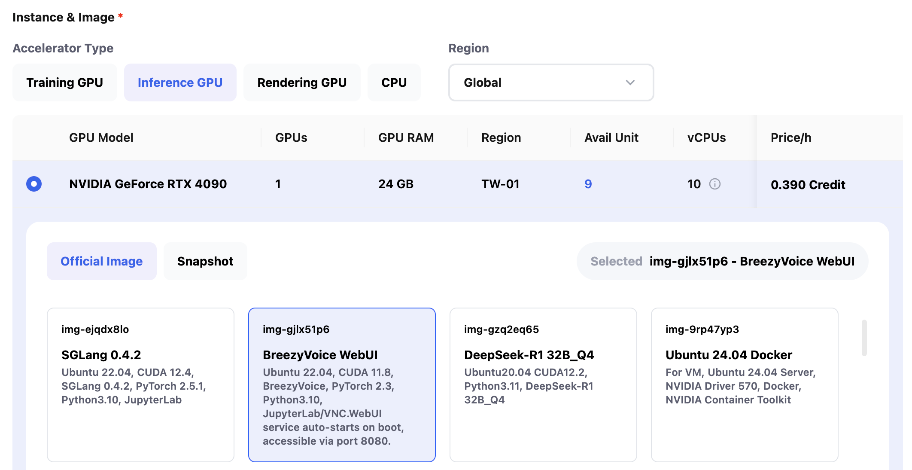
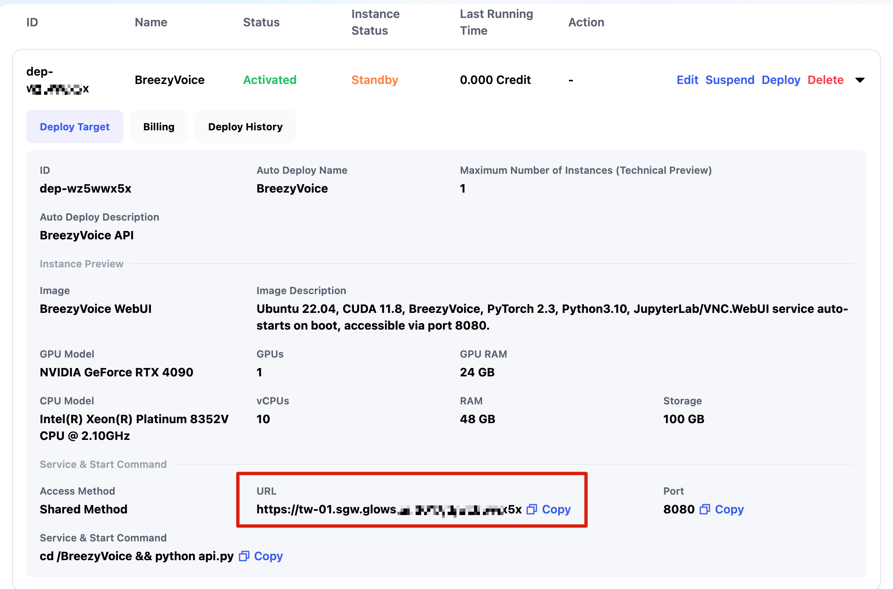

# Auto Deploy 使用說明

在一般情況下，使用 **GPU** 部署服務通常需要手動建立實例，並在使用完畢後自行釋放資源。對於需求較為零散的使用情境而言，這樣的操作流程較為繁瑣。

為了解決這個問題，**Glows.ai** 提供了 **Auto Deploy** 功能。只需完成一次設定，系統便會自動為您管理 **GPU** 實例的啟動與釋放流程。完成設定後，您將獲得一個固定的服務連結（**Service Link**）。當有請求發送至該連結時，**Glows.ai** 會依照您預先定義的設定自動建立實例、處理請求，並回傳結果。若連續 5 分鐘內無新的請求，系統將自動釋放實例，無須手動操作。

本篇說明將以 **BreezyVoice WebUI** 鏡像為例，示範如何設定與使用 **Auto Deploy** 功能。

---

### 步驟一：建立新的部署任務

1. 進入 **Auto Deploy** 頁面後，點選右上角的 `New Deploy` 按鈕，建立一個新的部署任務。



2. 請輸入任務名稱與簡要說明，以利日後辨識與管理。


3. 選擇執行程式所需的 **GPU** 類型與運行環境。您可以使用已創建的 **Snapshot**，或選擇系統提供的映像檔。



4. 請設定服務所需的連接埠（**Port**）與啟動指令（**Start Command**），並點選 `Confirm` 即可完成。
   本範例中，服務將啟動於 8080 端口，執行檔案為 **BreezyVoice** 目錄下的 api.py，因此設定如下：

```
Port: 8080
Start Command: cd /BreezyVoice && python api.py
```


5. 部署任務完成後，您將會得到一組固定的服務連結（**Service Link**）及相關資訊。



### 步驟二：使用 Auto Deploy link

1. 您只需將原本的 **API** 連結替換為 **Auto Deploy** 提供的服務連結，即可開始使用。如您的服務包含自訂路由，請在 **Auto Deploy Link** 後加上對應路徑。本範例中，部署的 **API** 路徑為 `/v1/audio/speech` ，呼叫方式如下：

```bash
curl -X POST "https://tw-01.sgw.glows.ai:xxxxxx/v1/audio/speech" \
 -H "Authorization: Bearer sk-template" \
 -H "Content-Type: application/json" \
 --data '{
  "model": "tts-1",
  "voice": "alloy",
  "input": "放學我們一起去打籃球怎麼樣，今天天氣不錯"
}' --output test_speech.wav
```


2. 在請求完成後，若 5 分鐘內未再發送新的 **API** 請求，將會自動釋放實例資源。您可以在 **Auto Deploy** 頁面中查看該部署任務的累計花費與目前的實例狀態（**Instance Status**）。各狀態說明如下：

- **Standby**：部署任務設定正常，目前未啟動任何實例。
- **Idle**：表示實例正在建立中（接收到請求時），或正在釋放中（請求處理完畢後）。
- **Running**：實例已成功啟動並正在處理請求。請求完成後，系統將持續等待新的請求；若 5 分鐘內無新請求，實例將自動釋放。


## 聯繫我們

如果您在使用 **Glows.ai** 的過程中有任何疑問或者建議，歡迎通過郵件或者 Line 聯繫我們。

**Email:** [support@glows.ai](mailto:support@glows.ai)

**Discord:** [https://discord.com/invite/glowsai](https://discord.com/invite/glowsai)

**Line:** [https://lin.ee/fHcoDgG](https://lin.ee/fHcoDgG)
