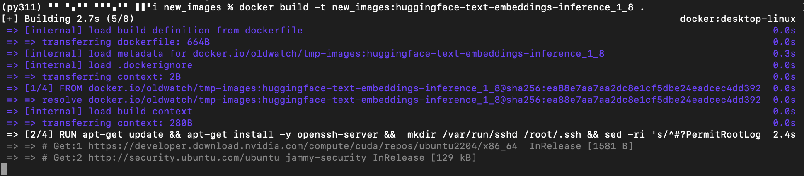
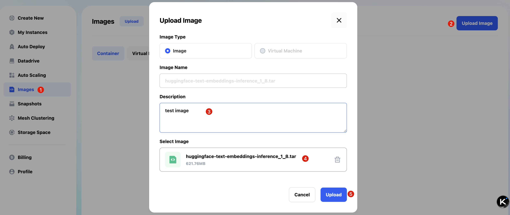
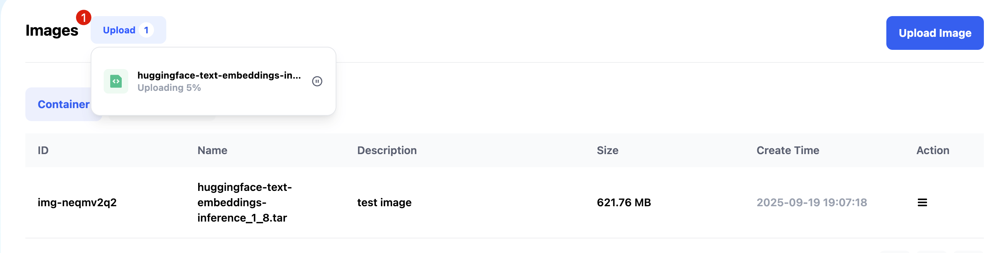
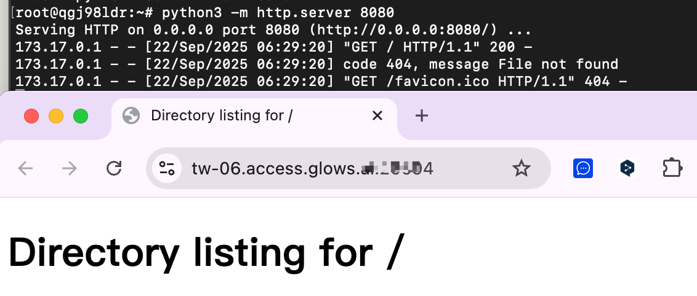

# 在 Glows.ai 上傳自訂 Docker 鏡像

本教學將帶你一步步學會如何把本地 Docker 鏡像上傳到 Glows.ai 使用，從鏡像準備、打包到上傳和創建實例完整示範。

## 製作 Docker image tar 包

要讓鏡像在 Glows.ai 正常運行，需注意以下事項：

- 鏡像的 ENTRYPOINT 需要保持運行（容器才不會自動退出）
- 安裝並啟動 SSH 服務（方便訪問實例）

### 設置說明

建議單獨寫一個 `.sh` 腳本作為 ENTRYPOINT，例如 `run_glowsai.sh`，裡面加入容器開機自啟的指令（SSH 服務或自定義服務等）。以下是範例：

```bash
#!/bin/bash
# Start SSH service
echo "Starting SSH service..."
/usr/sbin/sshd -E /root/.ssh/sshd_running.log

# Custom Command
echo "hello glowsai" > /hello.txt

# Keep the container running
echo "Container running..."
tail -f /dev/null
```

同時，在 Dockerfile 中加入 SSH 安裝配置及 ENTRYPOINT 設定：

```bash
# Install and configure SSH server
RUN apt-get update && apt-get install -y openssh-server && \
	mkdir /var/run/sshd /root/.ssh && sed -ri 's/^#?PermitRootLogin\s+.*/PermitRootLogin yes/' /etc/ssh/sshd_config && \
    sed -ri 's/UsePAM yes/#UsePAM yes/g' /etc/ssh/sshd_config && \
    apt-get clean && \
    rm -rf /var/lib/apt/lists/* /tmp/* /var/tmp/*

# Copy and set permissions for the start script
COPY run_glowsai.sh /usr/bin/
RUN chmod +x /usr/bin/run_glowsai.sh
EXPOSE 22
# Set entrypoint
ENTRYPOINT ["/usr/bin/run_glowsai.sh"]
```

### 實際操作

如果你要上傳本地鏡像，請先確認鏡像內已安裝並啟動 SSH，且 ENTRYPOINT 可保持運行，否則依照以下步驟操作。


1. 新建一個目錄 `new_images`，並在目錄下創建 `run_glowsai.sh`，內容如下：

```bash
#!/bin/bash
# Start SSH service
echo "Starting SSH service..."
/usr/sbin/sshd -E /root/.ssh/sshd_running.log

# Custom Command
echo "hello glowsai" > /hello.txt

# Keep the container running
echo "Container running..."
tail -f /dev/null
```

> 注意：`# Custom Command` 可寫入你需要開機自啟的指令，其他部分不要修改，以免啟動失敗。

2. 創建 `dockerfile`，輸入以下內容：

```bash
# Set the base image
FROM oldwatch/tmp-images:huggingface-text-embeddings-inference_1_8

# Install and configure SSH server
RUN apt-get update && apt-get install -y openssh-server && \
	mkdir /var/run/sshd /root/.ssh && sed -ri 's/^#?PermitRootLogin\s+.*/PermitRootLogin yes/' /etc/ssh/sshd_config && \
    sed -ri 's/UsePAM yes/#UsePAM yes/g' /etc/ssh/sshd_config && \
    apt-get clean && \
    rm -rf /var/lib/apt/lists/* /tmp/* /var/tmp/*

# Copy and set permissions for the start script
COPY run_glowsai.sh /usr/bin/
RUN chmod +x /usr/bin/run_glowsai.sh
EXPOSE 22
# Set entrypoint
ENTRYPOINT ["/usr/bin/run_glowsai.sh"]
```

3. 在目錄下執行以下指令 build 新鏡像：

```bash
docker build -t new_images:huggingface-text-embeddings-inference_1_8 .
```



4. build 成功後，使用 docker save 將鏡像打包成 tar：

```bash
docker save -o 保存文件路徑 鏡像名稱/鏡像id
```


## 上傳 Docker image tar 包

1. 打開 Glows.ai 的 Images 介面，點擊 `Upload Image`。
2. 輸入鏡像描述，點擊 Select Image 上傳剛打包的 tar 包。



3. 上傳中會顯示進度，上傳完成後即可在 Glows.ai 使用。



## 創建實例

1. 創建實例時選擇 My Images，可看到剛上傳的鏡像，選擇後若需要 Datadrive Mount 再完成實例創建。


2. 實例啟動後，手動設置需要導出的端口，例如 SSH 服務在 22 端口：

   - 點擊 `New Port Forwarding`
   - Service Port 設為 22
   - **不勾選 HTTPS**
   - 點擊 `Create` 完成端口導出


3. 設定完成後，約 10-20 秒端口映射建立完成，介面會顯示 SSH 鏈接與密碼，即可本地登入操作。


4. 若實例運行其他服務，需要公網訪問，可新增端口映射，HTTP 服務需勾選 HTTPS。


5. 以 HTTP 服務為例，啟動服務到 8080 端口，透過實例介面對應鏈接即可訪問服務。



6. 完成環境或文件修改後，可製作 Snapshot，或不再需要時直接釋放實例。


## 聯絡我們

如果你在使用 Glows.ai 過程中有任何問題或建議，歡迎透過 Email、Discord 或 Line 與我們聯絡。

**Glows.ai Email:** [support@glows.ai](mailto:support@glows.ai)

**Discord:** [https://discord.com/invite/glowsai](https://discord.com/invite/glowsai)

**Line:** [https://lin.ee/fHcoDgG](https://lin.ee/fHcoDgG)
