# 如何使用 VS Code 遠端連線至 Glows.ai

Visual Studio Code (VS Code) 提供遠端連線的功能，你可以使用 SSH 在 VS Code 內連線到 [Glows.ai](https://glows.ai)。

請注意，如果你計畫執行長時間的訓練腳本，強烈建議在終端機內使用 `tmux` 或 `nohup` 指令，這樣即使關閉 VS Code 也能確保執行不中斷。

---

## **步驟 1：安裝遠端開發擴充功能**

1. 從 [官方網站](https://code.visualstudio.com/) 下載並安裝最新版本的 VS Code。
2. 點選左側的 `擴充功能`，搜尋 **Remote Development**，然後點擊 `安裝`。
   此擴充功能會自動安裝必要的依賴項，包括 Remote-SSH、Remote-Containers 和 Remote-WSL。
   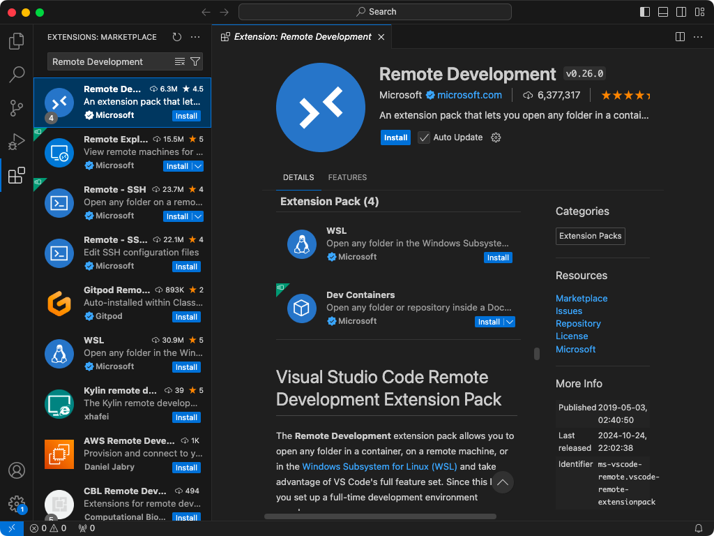

---

## **步驟 2：設定遠端連線**

1. 點選左下角的按鈕，選擇 `Connect to Host`。

   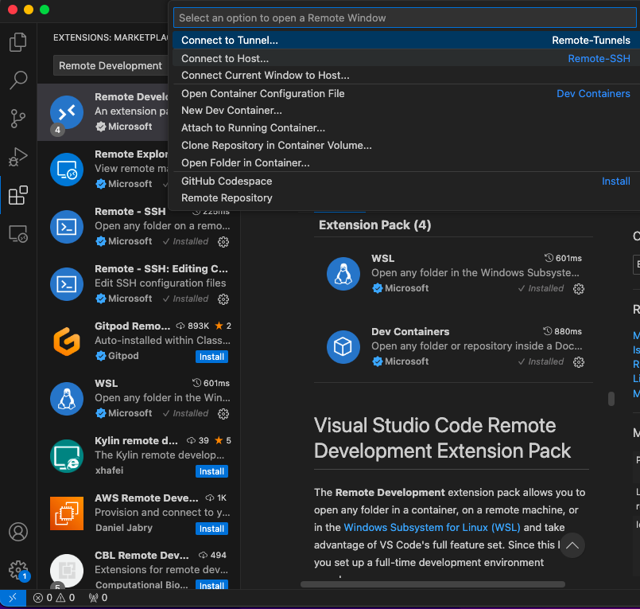

- 第一次使用時，請點擊 `Add New SSH Host`。
  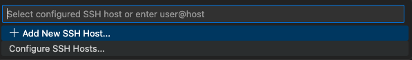

2. 前往 [Glows.ai](https://glows.ai) 複製 SSH 連線指令。

   

   SSH 連線指令格式如下：

```bash
ssh -p 23998 root@tw-02.access.glows.ai
```

請在連線前確認輸入無誤。

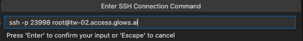

3.  在 VS Code 中輸入 SSH 指令並按下 `Enter`。
    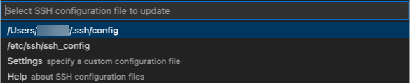

        第一個檔案為 SSH 設定檔，包含遠端 `Host`、`HostName`、`Port` 和 `User`。

        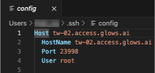

        請注意，重複進行 SSH 設定可能會導致設定檔內出現重複條目，影響連線功能。請確保 `Host` 唯一，並刪除重複的設定。

        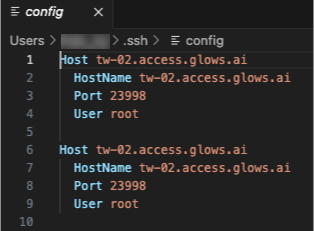

---

## **步驟 3：連線到遠端服務**

1. 再次點選左下角的按鈕，開啟遠端連線設定清單，然後選擇 `Connect to Host`。

   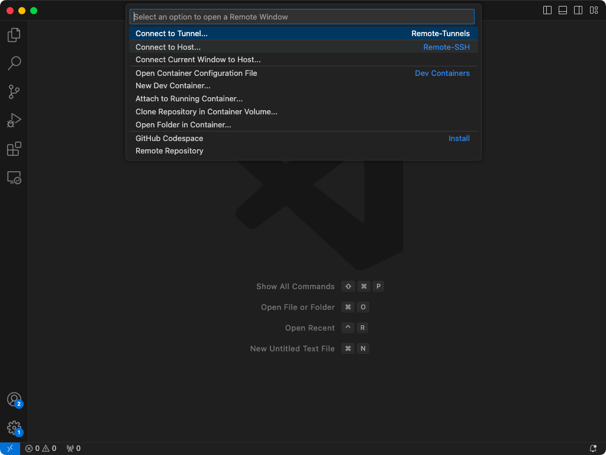

2. 找到 `glows.ai` 連線，點擊它。

   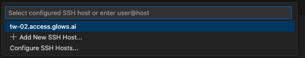

3. 若出現提示，請點擊 `Continue`

   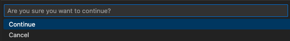

4. 若選擇密碼登入，系統會提示輸入密碼；若使用金鑰驗證且設定正確，則無需輸入密碼。

   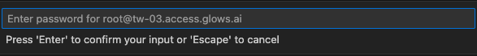

5. 連線成功後，左下角會顯示 `glows.ai`。

   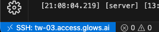

---

## **步驟 4：在遠端伺服器執行指令**

1. 你可以在 VS Code 的終端機內執行遠端指令，例如檢查 GPU 狀態。

   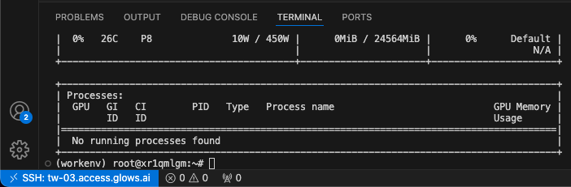

2. 你可以存取並修改遠端伺服器上的檔案。

   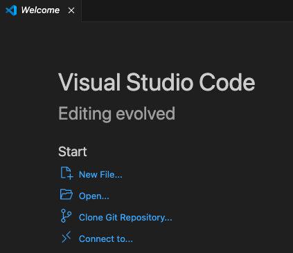

3. 若需要存取 Glows.ai 的 `datadrive`，請將預設的 `/root` 切換為 `/datadrive`。

   

4. 點擊 `/datadrive` 目錄後，你可以逐層瀏覽檔案目錄。

   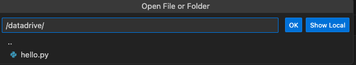

---

## **步驟 5：斷開與遠端服務的連線**

如果要斷開 VS Code 的遠端連線，請點擊左下角，然後選擇 `Close Remote Connection`。

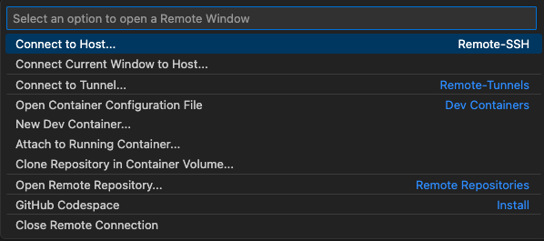

若需重新連線，請重複 **步驟 3：連線到遠端服務**。

---

## **步驟 6：修改遠端連線設定**

1. 若切換到不同實例，遠端連線的 `Port` 可能會改變。
   這時可點擊左下角按鈕，然後選擇 `Connect to Host`。

   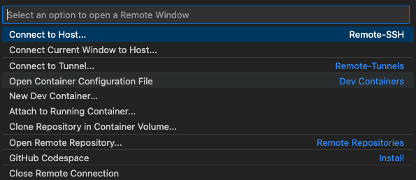

2. 選擇 `Configure SSH Hosts`。

   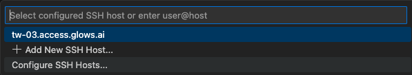

3. 點選第一個檔案。

   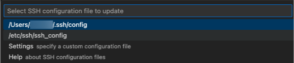

4. 修改 `HostName` 為當前主機，並將 `Port` 設定為新端口號。

   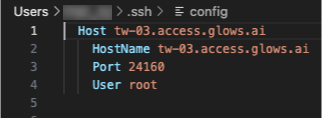

5. 按 `Ctrl + S` 儲存設定。

完成後，請重複 **步驟 3：連線到遠端服務**。

---

這樣，你就可以成功使用 VS Code 遠端連線至 Glows.ai 了！🎉
